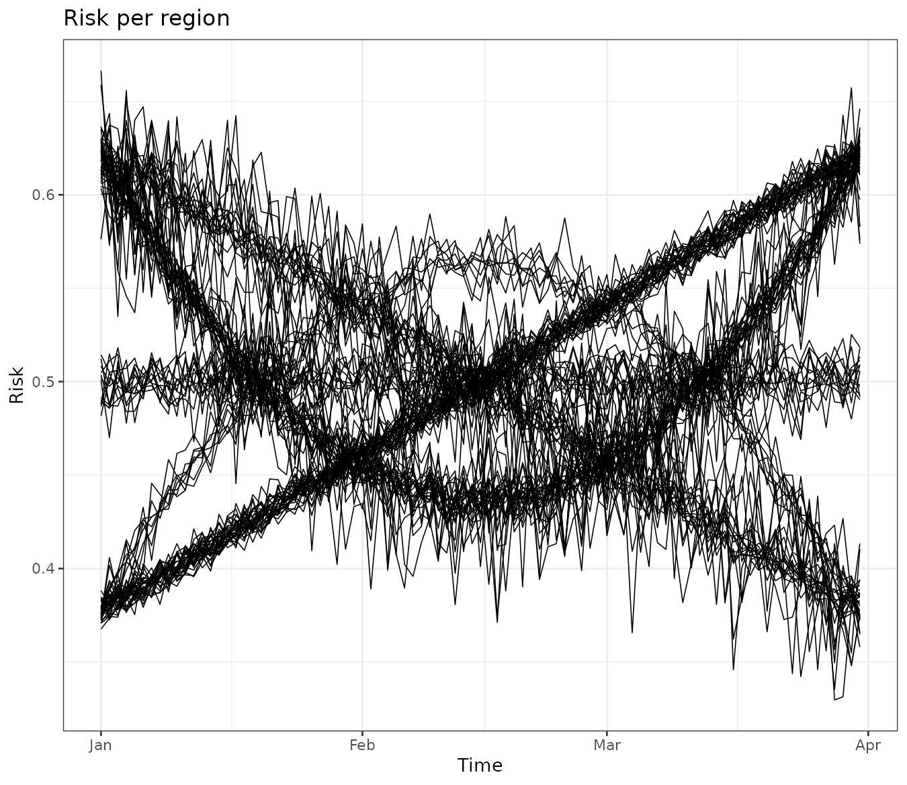
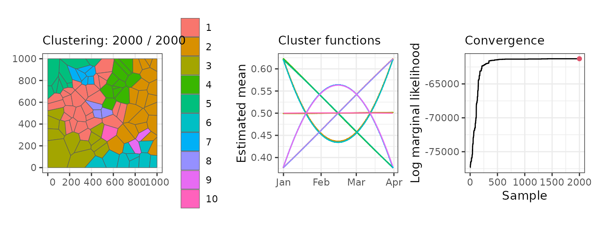
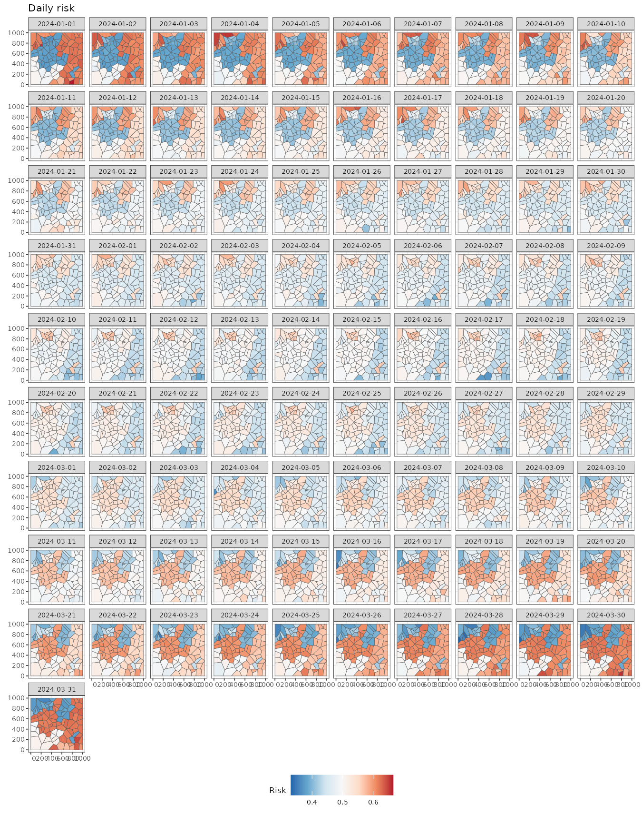
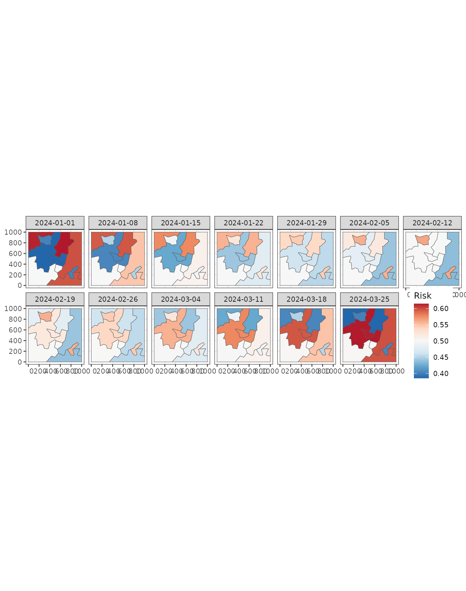
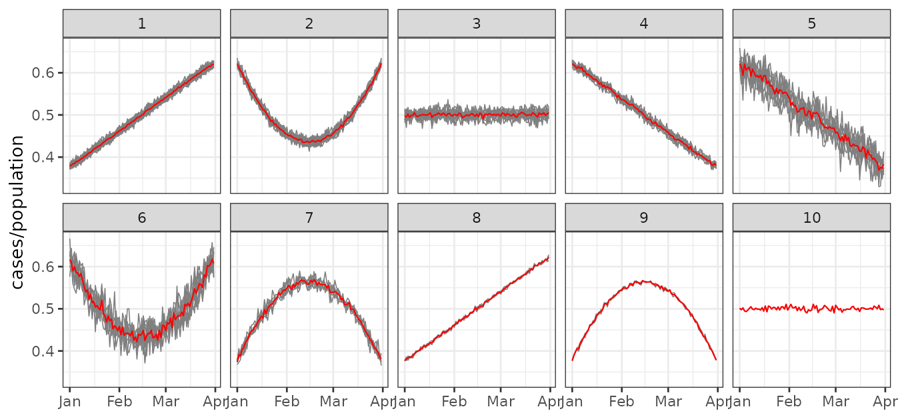

# Introduction to sfclust

In this vignette, we demonstrate the basic use of `sfclust` for spatial
clustering. Specifically, we focus on a synthetic dataset of disease
cases to identify regions with similar disease risk over time.

## Packages

We begin by loading the required packages. In particular, we load the
`stars` package as our `sfclust` package works with spacio-temporal
`stars` objects.

``` r

library(sfclust)
library(stars)
library(ggplot2)
```

## Data

The simulated dataset used in this vignette, `stbinom`, is included in
our package. It is a `stars` object with two variables, `cases` and
`population`, and two dimensions, `geometry` and `time`. The dataset
represents the number of cases in 100 regions, observed daily over 91
days, starting in January 2024.

``` r

stbinom
```

    #> stars object with 2 dimensions and 2 attributes
    #> attribute(s):
    #>              Min. 1st Qu.  Median     Mean 3rd Qu.  Max.
    #> cases        4632  9295.0 11760.5 11903.97 14238.0 26861
    #> population  10911 18733.5 24255.0 23814.57 27517.5 44829
    #> dimension(s):
    #>          from  to     offset  delta refsys point
    #> geometry    1 100         NA     NA     NA FALSE
    #> time        1  91 2024-01-01 1 days   Date FALSE
    #>                                                                 values
    #> geometry POLYGON ((59.5033 683.285...,...,POLYGON ((942.7562 116.89...
    #> time                                                              NULL

We can easily visualize the spatio-temporal risk using `ggplot` and
[`stars::geom_stars`](https://r-spatial.github.io/stars/reference/geom_stars.html).
It shows some neightboring regions with similar risk patterns over time.

``` r

ggplot() +
    geom_stars(aes(fill = cases/population), data = stbinom) +
    facet_wrap(~ time) +
    scale_fill_distiller(palette = "RdBu") +
    labs(title = "Daily risk", fill = "Risk") +
    theme_bw(base_size = 7) +
    theme(legend.position = "bottom")
```


We can aggregate the data for easier visualization using the
[`stars::aggregate`](https://r-spatial.github.io/stars/reference/aggregate.stars.html)
function. The following figure displays the weekly mean risk, providing
initial insights. For This figure displays the daily risk, providing
initial insights. For example, the northwestern regions show a higher
risk at the beginning (2024-01-01), followed by a decline by March 24.
In contrast, a group of regions on the eastern side exhibits high risk
at both the beginning (2024-01-01) and the end (2024-03-25) but lower
values in the middle of the study period (2024-02-12).

It is also useful to examine trends for each region. This can be done by
converting the `stars` object into a data frame using the
`stars::as_tibble` function. The visualization reveals that some regions
exhibit very similar trends over time. Our goal is to cluster these
regions while considering spatial contiguity.

``` r

stbinom |>
  st_set_dimensions("geometry", values = 1:nrow(stbinom)) |>
  as.data.frame() |>
  ggplot() +
    geom_line(aes(time, cases/population, group = geometry), linewidth = 0.3) +
    theme_bw() +
    labs(title = "Risk per region", y = "Risk", x = "Time")
```



``` r

head(data_all(stbinom))
```

    #>   id ids idt       time cases population
    #> 1  1   1   1 2024-01-01 10023      26062
    #> 2  2   2   1 2024-01-01 16022      26411
    #> 3  3   3   1 2024-01-01 10829      21504
    #> 4  4   4   1 2024-01-01  9358      15325
    #> 5  5   5   1 2024-01-01 11702      23981
    #> 6  6   6   1 2024-01-01  6914      13807

## Clustering

### Model

Our model-based approach to spatial clustering requires defining a
within-cluster model, where regions within the same cluster share common
parameters and latent functions. In this example, given the clustering
or partition $`M`$, we assume that the observed number of cases
($`y_{it}`$) for region $`i`$ at time $`t`$ is a realization of a
Binomial random variable $`Y_{it}`$ with size $`N_{it}`$ and success
probability $`p_{it}`$:
``` math
Y_{it} \mid p_{it}, N_{it}, M \stackrel{ind}{\sim} \text{Binomial}(p_{it},N_{it}).
```

Based on our exploratory analysis, the success probability $`p_{it}`$ is
modeled as:
``` math
\text{logit}(p_{it}) =  \alpha_{c_i} + \boldsymbol{x}_{t}^T\boldsymbol{\beta}_{c_i} + f_{it},
```
where $`\alpha_{c_i}`$ is the intercept for cluster $`c_i`$, and
$`\boldsymbol{x}_{t}`$ represents a set of polynomial functions of time
that capture global trends with a cluster-specific effect
$`\boldsymbol{\beta}_{c_i}`$. Additionally, we include an independent
random effect,
$`f_{it} \stackrel{iid}{\sim} \text{Normal}(0, \sigma_{c_i})`$, to
account for extra space-time variability.

Since we perform Bayesian inference, we impose prior distributions on
the model parameters. The intercept $`\alpha_{c_i}`$ and regression
coefficients $`\boldsymbol{\beta}_{c_i}`$ follow a Normal distribution,
while the prior for the hyperparameter $`\sigma_{c_i}`$ is defined as:
``` math
\log(1/\sigma_{c_i}) \sim \text{LogGamma}(1, 10^{-5}).
```
Notably, all regions within the same cluster share the same parameters:
$`\alpha_{c_i}`$, regression coefficients $`\boldsymbol{\beta}_{c_i}`$,
and random-effect standard deviation $`\sigma_{c_i}`$.

### Sampling with `sfclust`

In order to perform Bayesian spatial functional clustering with the
model above we use the main function `sfclust`. The main arguments of
this function are:

- `stdata`: The spatio-temporal data which should be a `stars` object.
- `stnames`: Names of the spatial and time dimensions respectively
  (default: `c("geometry", "time")`).
- `niter`: Number of iteration for the Markov chain Monte Carlo
  algorithm.

Notice that given that `sfclust` uses MCMC and INLA to perform Bayesian
inference, it accepts any argument of the
[`INLA::inla`](https://rdrr.io/pkg/INLA/man/inla.html) function. Some
main arguments are:

- `formula`: expression to define the model with fixed and random
  effects. `sfclust` pre-process the data and create identifiers for
  regions `ids`, times `idt` and space-time `id`. You can incluse these
  identifiers in your formula.
- `family`: distribution of the response variable.
- `Ntrials`: Number of trials in case of a Binomial response.
- `E`: Expected number of cases for a Poisson response.

The following code perform the Bayesian function clustering for the
model explained above with 2000 iterations.

``` r

set.seed(7)
result <- sfclust(stbinom, formula = cases ~ poly(time, 2) + f(id),
  family = "binomial", Ntrials = population, niter = 2000)
names(result)
```

    #> [1] "samples" "clust"

The returning object is of class `sfclust`, which is a list of two
elements:

- `samples`: list containing the `membership` samples, the logarithm of
  the marginal likelihood `log_mlike` and the clustering movements
  `move_counts` done in total.
- `clust`: list containing the selecting `membership` from `samples`.
  This include the `id` of selected sample, the selected `membership`
  and the `models` associated to each cluster.

## Basic methods

### Print

By default, the `sfclust` object prints the within-cluster model, the
clustering hyperparameters, the movements counts, and the current log
marginal likelihood.

``` r

result
```

    #> Within-cluster formula:
    #> cases ~ poly(time, 2) + f(id)
    #> 
    #> Clustering hyperparameters:
    #>   log(1-q)      birth      death     change      hyper 
    #> -0.6931472  0.4250000  0.4250000  0.1000000  0.0500000 
    #> 
    #> Clustering movement counts:
    #>  births  deaths changes  hypers 
    #>      60      60      17      90 
    #> 
    #> Log marginal likelihood (sample 2000 out of 2000): -61286.28

The output indicates that the within-cluster model is specified using
the formula `cases ~ poly(time, 2) + f(id)`, which is compatible with
INLA. This formula includes polynomial fixed effects and an independent
random effect per observation.

The displayed hyperparameters are used in the clustering algorithm. The
hyperparameter `log(1-q) = 0.5` penalizes the increase of clusters,
while the other parameters control the probabilities of different
clustering movements:

- The probability of splitting a cluster is 0.425.
- The probability of merging two clusters is 0.425.
- The probability of simultaneously splitting and merging two clusters
  is 0.1.
- The probability of modifying the minimum spanning tree is 0.05.

Users can modify these hyperparameters as needed. The output also
displays clustering movements. The output summary indicates the
following:

- Clusters were splited 60 times.
- Clusters were merged 60 times.
- Clusters were simultaneously split and merged 17 times.
- The minimum spanning tree was updated 90 times.

Finally, the log marginal likelihood for the last iteration (2000) is
reported as -61,286.28.

### Plot

The `plot` method generates three main graphs:

1.  A map of the regions colored by clusters.
2.  The mean function per cluster.
3.  The marginal likelihood for each iteration.

In our example, the left panel displays the regions grouped into the 10
clusters found in the 2000th (final) iteration. The middle panel shows
the mean linear predictor curves for each cluster. Some clusters exhibit
linear trends, while others follow quadratic trends. Although some
clusters have similar mean trends, they are classified separately due to
differences in other parameters, such as the variance of the random
effects.

Finally, the right panel presents the marginal likelihood for each
iteration. The values stabilize around iteration 1500, indicating that
any clustering beyond this point can be considered a reasonable
realization of the clustering distribution.

``` r

plot(result, sort = TRUE, legend = TRUE)
```



### Summary

Once convergence is observed in the clustering algorithm, we can
summarize the results. By default, the summary is based on the last
sample. The output of the `summary` method confirms that it corresponds
to the 2000th sample out of a total of 2000. It also displays the model
formula, similar to the `print` method.

Additionally, the summary provides the number of members in each
cluster. For example, in this case, Cluster 1 has 27 members, Cluster 2
has 12 members, and so on. Finally, it reports the associated
log-marginal likelihood.

``` r

summary(result)
```

    #> Summary for clustering sample 2000 out of 2000 
    #> 
    #> Within-cluster formula:
    #> cases ~ poly(time, 2) + f(id)
    #> 
    #> Counts per cluster:
    #>  1  2  3  4  5  6  7  8  9 10 
    #> 27 12  9  9 11 20  6  1  2  3 
    #> 
    #> Log marginal likelihood:  -61286.28

We can also summarize any other sample, such as the 500th iteration. The
output clearly indicates that the log-marginal likelihood is much
smaller in this case. Keep in mind that all other `sfclust` methods use
the last sample by default, but you can specify a different sample if
needed.

``` r

summary(result, sample = 500)
```

    #> Summary for clustering sample 500 out of 2000 
    #> 
    #> Within-cluster formula:
    #> cases ~ poly(time, 2) + f(id)
    #> 
    #> Counts per cluster:
    #>  1  2  3  4  5  6  7  8  9 10 11 12 13 14 15 
    #> 26 12  9  8 11  4 16  1  5  1  2  1  2  1  1 
    #> 
    #> Log marginal likelihood:  -61439.52

Cluster labels are assigned arbitrarily, but they can be relabeled based
on the number of members using the option `sort = TRUE`. The following
output shows that, in the last sample, the first seven clusters have
more than four members, while the last three clusters have fewer than
four members.

``` r

summary(result, sort = TRUE)
```

    #> Summary for clustering sample 2000 out of 2000 
    #> 
    #> Within-cluster formula:
    #> cases ~ poly(time, 2) + f(id)
    #> 
    #> Counts per cluster:
    #>  1  2  3  4  5  6  7  8  9 10 
    #> 27 20 12 11  9  9  6  3  2  1 
    #> 
    #> Log marginal likelihood:  -61286.28

### Fitted values

We can obtain the estimated values for our model using the `fitted`
function, which returns a `stars` object in the same format as the
original data. It provides the mean, standard deviation, quantiles, and
other summary statistics.

``` r

pred <- fitted(result)
pred
```

    #> stars object with 2 dimensions and 5 attributes
    #> attribute(s):
    #>                         Min.    1st Qu.        Median          Mean   3rd Qu.
    #> mean              -0.7055731 -0.1988638 -0.0055543163 -0.0004677087 0.1850758
    #> mean_inv           0.3305778  0.4504473  0.4986114245  0.4998542289 0.5461373
    #> cluster            1.0000000  1.0000000  4.0000000000  3.8700000000 6.0000000
    #> mean_cluster      -0.5011533 -0.1986104  0.0001815312 -0.0004677297 0.1898616
    #> mean_cluster_inv   0.3772697  0.4505100  0.5000453828  0.4998533938 0.5473233
    #>                         Max.
    #> mean               0.6887139
    #> mean_inv           0.6656808
    #> cluster           10.0000000
    #> mean_cluster       0.5015424
    #> mean_cluster_inv   0.6228217
    #> dimension(s):
    #>          from  to     offset  delta refsys point
    #> geometry    1 100         NA     NA     NA FALSE
    #> time        1  91 2024-01-01 1 days   Date FALSE
    #>                                                                 values
    #> geometry POLYGON ((59.5033 683.285...,...,POLYGON ((942.7562 116.89...
    #> time                                                              NULL

We can easily visualize these fitted values. Note that there are still
differences between regions within the same cluster due to the presence
of random effects at the individual level.

``` r

ggplot() +
    geom_stars(aes(fill = mean_inv), data = pred) +
    facet_wrap(~ time) +
    scale_fill_distiller(palette = "RdBu") +
    labs(title = "Daily risk", fill = "Risk") +
    theme_bw(base_size = 7) +
    theme(legend.position = "bottom")
```



To gain further insights, we can compute the mean fitted values per
cluster using `aggregate = TRUE`. This returns a `stars` object with
cluster-level geometries.

``` r

pred <- fitted(result, sort = TRUE, aggregate = TRUE)
pred
```

    #> stars object with 2 dimensions and 2 attributes
    #> attribute(s):
    #>                         Min.    1st Qu.      Median          Mean   3rd Qu.
    #> mean_cluster      -0.5011527 -0.1716051 0.001578613 -0.0005899816 0.1701283
    #> mean_cluster_inv   0.3772698  0.4572037 0.500394653  0.4998562818 0.5424298
    #>                        Max.
    #> mean_cluster      0.5015421
    #> mean_cluster_inv  0.6228217
    #> dimension(s):
    #>          from to     offset  delta refsys point
    #> geometry    1 10         NA     NA     NA FALSE
    #> time        1 91 2024-01-01 1 days   Date FALSE
    #>                                                                 values
    #> geometry POLYGON ((149.5651 508.30...,...,POLYGON ((491.7737 272.18...
    #> time                                                              NULL

Using these estimates, we can visualize the cluster-level mean risk
evolution over time.

``` r

predweekly <- aggregate(pred, by = "week", FUN = mean)
ggplot() +
  geom_stars(aes(fill = mean_cluster_inv), data = predweekly) +
  facet_wrap(~ time, nrow = 2) +
  scale_fill_distiller(palette = "RdBu") +
  labs(fill = "Risk") +
  theme_bw(base_size = 10) +
  theme(legend.position = c(0.93, 0.22))
```



``` r

if (save_figures) {
  ggsave(file.path(path_figures, "stbinom-weekly-risk-per-cluster.pdf"), width = 10, height = 3.5,
    device = cairo_pdf)
}
```

Finally, we can use our clustering results to visualize the original
data grouped by clusters using the function
[`plot_clusters_series()`](../reference/plot_clusters_series.md). As the
output is a `ggplot` object, then we can easily customize the output as
follows:

``` r

plot_clusters_series(result, cases/population, sort = TRUE) +
  facet_wrap(~ cluster, ncol = 5)
```



Even though some clusters exhibit similar trends—for example, clusters 2
and 6—the variability between them differs, which justifies their
classification as separate clusters.
