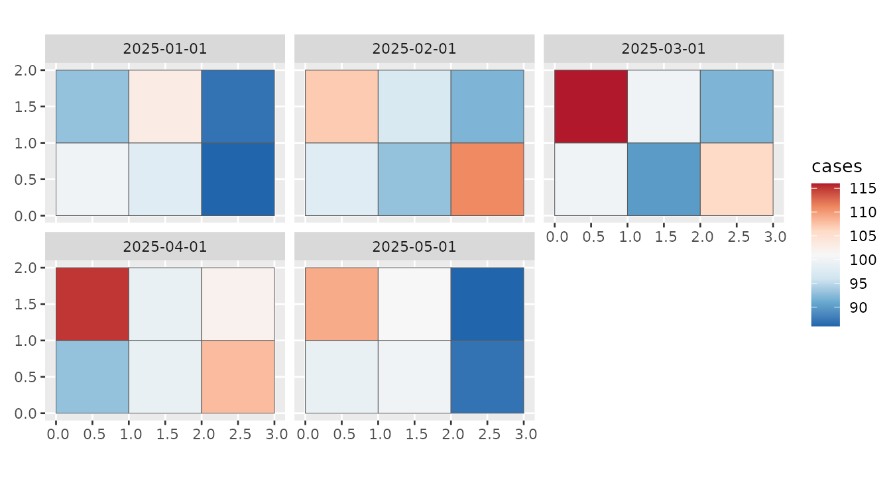

# Create a stars dataset

Our package `sfclust` is designed to work with spatio-temporal data
structured as a `stars` object. In this vignette, we demonstrate how to
create and manipulate a basic `stars` object.

``` r

library(stars)
library(ggplot2)
```

## Simulated data

To begin, we need data that varies across both regions and time. In this
example, we simulate such data for illustrative purposes, but in
practice, this would come from your study’s specific regions and time
periods.

``` r

set.seed(10)
space <- st_make_grid(cellsize = c(1, 1), offset = c(0, 0), n = c(3, 2))
time <- seq(as.Date("2025-01-01"), by = "1 month", length.out = 5)
```

Next, we simulate variables associated with each region and time point.
In this case, we create values for `cases`, `temperature`, and
`precipitation`. Each variable is stored in a matrix where rows
correspond to regions and columns to time points.

``` r

cases <- matrix(rpois(30, 100), nrow = 6, ncol = 5)
temperature <- matrix(rnorm(30), nrow = 6, ncol = 5)
precipitation <- matrix(rnorm(30), nrow = 6, ncol = 5)
```

## Creating a `stars` object

We now use the simulated data to construct a `stars` object. This object
will contain spatial and temporal dimensions, along with the three
simulated variables stored as attributes. While there are several ways
to build such objects, the following method is commonly used:

``` r

stdata <- st_as_stars(
  cases = cases, temperature = temperature, precipitation = precipitation,
  dimensions = st_dimensions(geometry = space, time = time)
)
stdata
```

    #> stars object with 2 dimensions and 3 attributes
    #> attribute(s):
    #>                     Min.    1st Qu.      Median        Mean     3rd Qu.
    #> cases          86.000000 93.0000000 99.00000000 98.90000000 102.7500000
    #> temperature    -2.060541 -0.4165786  0.06808151  0.02795936   0.5496759
    #> precipitation  -1.676105 -0.7343718 -0.17034766 -0.09712102   0.4299561
    #>                      Max.
    #> cases          116.000000
    #> temperature      1.766004
    #> precipitation    2.106161
    #> dimension(s):
    #>          from to refsys point
    #> geometry    1  6     NA FALSE
    #> time        1  5   Date FALSE
    #>                                                                 values
    #> geometry POLYGON ((0 0, 1 0, 1 1, ...,...,POLYGON ((2 1, 3 1, 3 2, ...
    #> time                                         2025-01-01,...,2025-05-01

## Manipulating a `stars` object

Once the `stars` object is created, you can use any of the methods
provided by the [`stars`](https://r-spatial.github.io/stars/index.html)
package. For example, we can visualize the `cases` variable across time:

``` r

ggplot() +
    geom_stars(aes(fill = cases), data = stdata) +
    facet_wrap(~ time) +
    scale_fill_distiller(palette = "RdBu")
```



You can also add additional variables to the `stars` object. For
instance, let’s add a `population` variable:

``` r

stdata["population"] <- rep(rpois(6, 1000), times = 5)
stdata
```

    #> stars object with 2 dimensions and 4 attributes
    #> attribute(s):
    #>                      Min.     1st Qu.        Median          Mean      3rd Qu.
    #> cases           86.000000  93.0000000   99.00000000   98.90000000  102.7500000
    #> temperature     -2.060541  -0.4165786    0.06808151    0.02795936    0.5496759
    #> precipitation   -1.676105  -0.7343718   -0.17034766   -0.09712102    0.4299561
    #> population     953.000000 975.0000000 1016.00000000 1005.00000000 1032.0000000
    #>                       Max.
    #> cases           116.000000
    #> temperature       1.766004
    #> precipitation     2.106161
    #> population     1038.000000
    #> dimension(s):
    #>          from to refsys point
    #> geometry    1  6     NA FALSE
    #> time        1  5   Date FALSE
    #>                                                                 values
    #> geometry POLYGON ((0 0, 1 0, 1 1, ...,...,POLYGON ((2 1, 3 1, 3 2, ...
    #> time                                         2025-01-01,...,2025-05-01
