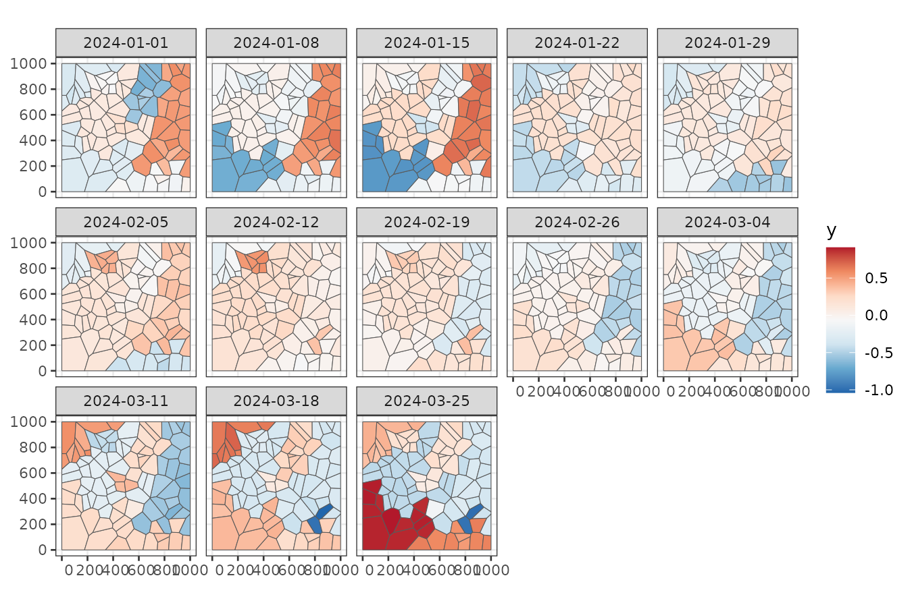
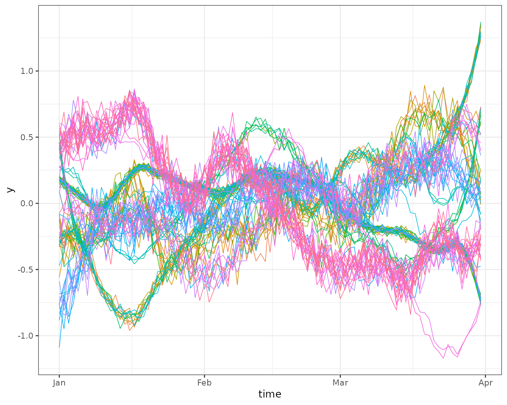
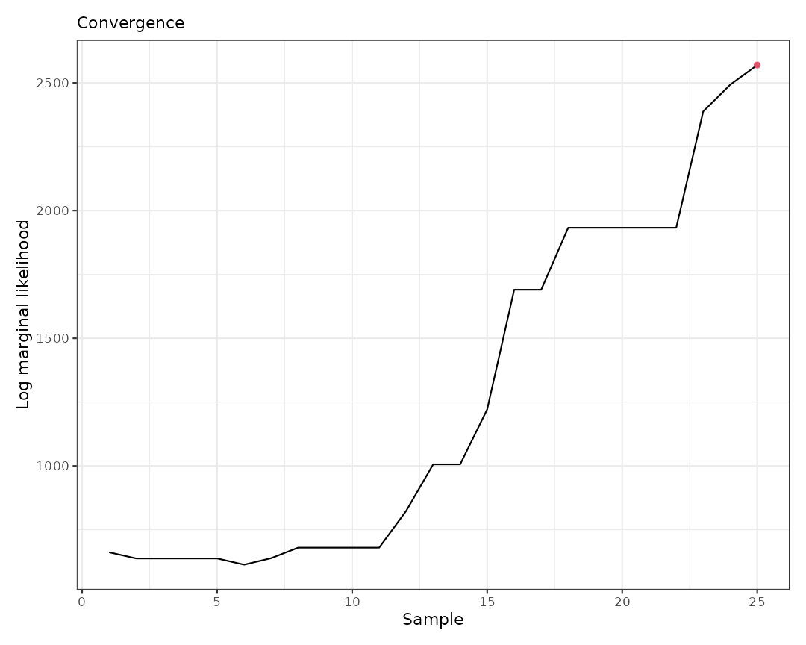
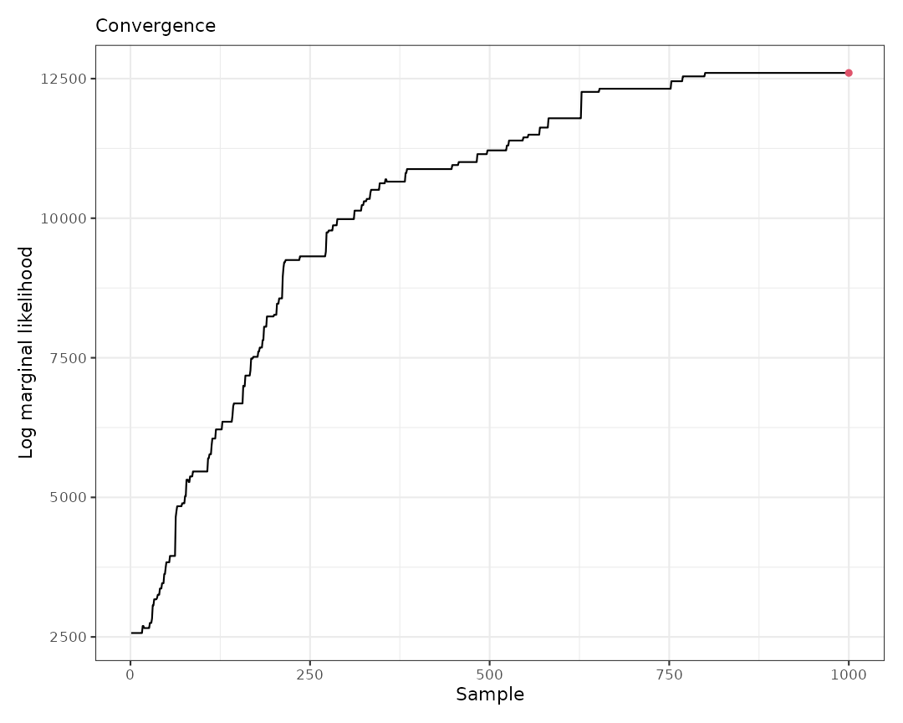
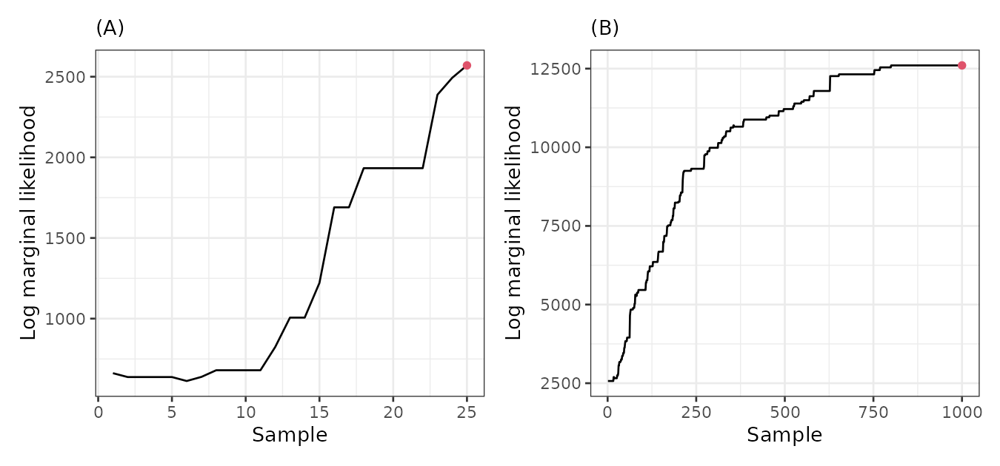
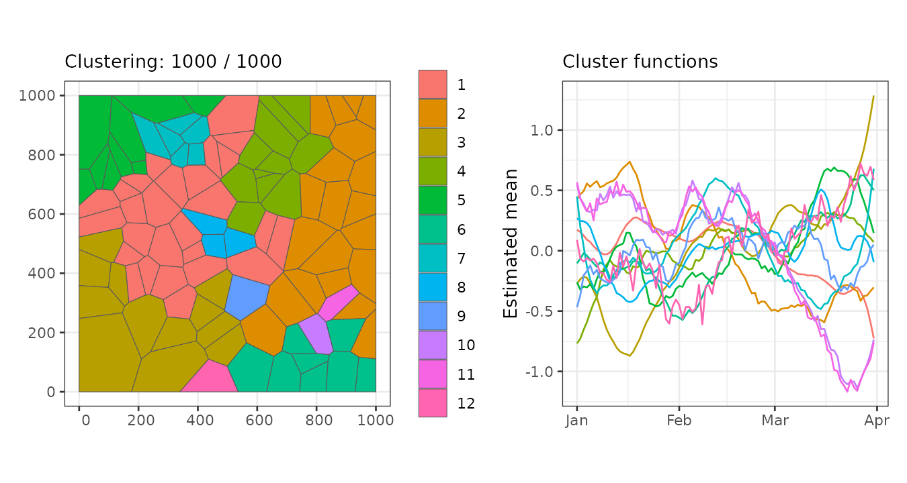
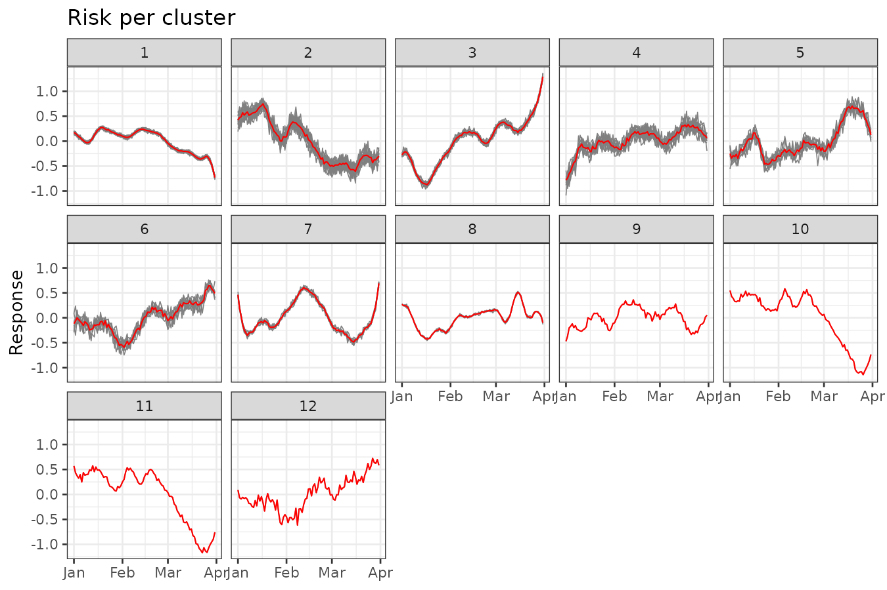

# Advanced features

In this vignette we present additional features of the `sfclust`
package.

## Packages

We begin by loading the required packages.

``` r

library(sfclust)
library(stars)
library(ggplot2)
library(dplyr)
```

## Data

The simulated dataset used in this vignette, `stgaus`, is included in
our package. It is a `stars` object with one variable, `y`, and two
dimensions: `geometry` and `time`. The dataset represents continuous
Gaussian measurements from 100 regions, observed daily over 91 days,
starting in January 2024.

``` r

data("stgaus")
stgaus
```

    #> stars object with 2 dimensions and 1 attribute
    #> attribute(s):
    #>         Min.    1st Qu.    Median          Mean   3rd Qu.     Max.
    #> y  -1.170275 -0.2390084 0.0302046 -0.0004274323 0.2095926 1.370593
    #> dimension(s):
    #>          from  to     offset  delta refsys point
    #> geometry    1 100         NA     NA     NA FALSE
    #> time        1  91 2024-01-01 1 days   Date FALSE
    #>                                                                 values
    #> geometry POLYGON ((59.5033 683.285...,...,POLYGON ((942.7562 116.89...
    #> time                                                              NULL

To gain some initial insights, we can aggregate the data weekly:

``` r

stweekly <- aggregate(stgaus, by = "week", FUN = mean)
ggplot() +
    geom_stars(aes(fill = y), stweekly) +
    facet_wrap(~ time, ncol = 5) +
    scale_fill_distiller(palette = "RdBu") +
    theme_bw()
```



We can also examine the trends for each region:

``` r

stgaus |>
    st_set_dimensions("geometry", values = 1:nrow(stgaus)) |>
    as_tibble() |>
    ggplot() +
    geom_line(aes(time, y, group = geometry, color = factor(geometry)), linewidth = 0.3) +
    theme_bw() +
    theme(legend.position = "none")
```



Some regions exhibit similar trends over time, but the overall patterns
are more complex than polynomial functions. Our goal is to cluster these
regions while accounting for spatial contiguity.

## Clustering

### Model

We assume that the response variable $`Y_{it}`$ for region $`i`$ at time
$`t`$ follows a normal distribution given the partition $`M`$:
``` math
Y_{it} \mid \mu_{it}, M \stackrel{ind}{\sim} \text{Normal}(\mu_{it}, \sigma^2),
```
where the mean $`\mu_{it}`$ is modeled based on the cluster assignment
$`c_i`$:
``` math
\mu_{it} = \alpha_{c_i} + f_{c_i,t},
```
where $`\alpha_{c_i}`$ is the intercept for cluster $`c_i`$, and
$`f_{c_i,t}`$ is a latent random effect modeled as a random walk
process. Specifically, we impose the condition:
``` math
f_{c_i,t} - f_{c_i,t-1} \sim N(0, \nu^{-1}), \quad \text{for } t = 2, \dots, n.
```

The prior for the hyperparameter $`\nu_c`$ is defined as:
``` math
\log(\nu_c) \sim \text{Normal}(-2, 1).
```

### INLA integration

`sfclust` integrates seamlessly with `inla()`, letting us specify the
within-cluster model above exactly as we would in a standard `INLA`
workflow. The model formula (including random effects and priors) and
any additional arguments are passed directly to `inla()`. The following
formula defines a linear predictor with a first-order random walk and
the prior `Normal(-2, 1)` on the log-precision described above; we reuse
this `formula` object in the examples below.

``` r

formula <- y ~ f(id_time, model = "rw1",
  hyper = list(prec = list(prior = "normal", param = c(-2, 1))))
```

You can define other latent models and priors following `INLA`
conventions. Further documentation is available at
<https://www.r-inla.org/documentation>.

### Penalizing the number of clusters

The `logpen` argument sets the log-penalty on the number of clusters,
specifically `log(1 - q)`, where `q` is the prior probability of keeping
a cluster: there is no penalty when `logpen = 0`, and more negative
values increasingly favor fewer clusters. A large negative value such as
`-50` acts as a strong parsimony prior, meaning that any proposal to
increase the number of clusters must improve the log marginal likelihood
by around 50 units to have a high acceptance probability.

### Save options

Besides `niter`, `burnin` discards the first iterations before saving
samples, and `thin` retains only every `thin`-th iteration, reducing
autocorrelation in the chain. Note that `niter` counts iterations
*after* burn-in, so the algorithm runs `burnin + niter` iterations in
total. To reduce the risk of losing intermediate results, especially
given the computational cost of the algorithm, you can use the
`path_save` argument to specify a file for saving the output, and
`nsave` to define the frequency at which samples are saved.

### Sampling with `sfclust`

We now put all of the above together. We start with 20 initial clusters
(`nclust = 20`) and run the algorithm for only 50 iterations, using the
strong penalty and formula defined above, and saving intermediate
results to `"stgaus-mcmc-initial.rds"`.

``` r

set.seed(123)
result0 <- sfclust(stgaus, nclust = 20, formula = formula, logpen = -50,
  niter = 50, burnin = 10, thin = 2, nmessage = 10,
  path_save = "stgaus-mcmc-initial.rds")
result0
```

    #> Within-cluster formula:
    #> y ~ f(id_time, model = "rw1", hyper = list(prec = list(prior = "normal", 
    #>     param = c(-2, 1))))
    #> 
    #> Clustering hyperparameters:
    #> log(1-q)    birth    death   change    hyper 
    #>  -50.000    0.425    0.425    0.100    0.050 
    #> 
    #> Clustering movement counts:
    #>  births  deaths changes  hypers 
    #>      11       8       1       2 
    #> 
    #> Log marginal likelihood (sample 25 out of 25): 2570.063

The output indicates that after starting with 20 clusters, the algorithm
created 11 new clusters (births), removed 8 clusters (deaths), changed
the membership of 1 cluster, and modified the minimum spanning tree
(MST) 2 times.

The `plot` method allows us to select which graph to produce. For
example, we can visualize only the log marginal likelihood to diagnose
convergence. With just 50 iterations, we can see that the log marginal
likelihood has not yet achieved convergence.

``` r

plot(result0, which = 3)
```



### Continue sampling

To achieve convergence, we can continue the sampling using the `update`
function and specify the number of new iterations with the `niter`
argument:

``` r

result <- update(result0, niter = 1000, nsave = 500, path_save = "stgaus-mcmc.rds")
result
```

    #> Within-cluster formula:
    #> y ~ f(id_time, model = "rw1", hyper = list(prec = list(prior = "normal", 
    #>     param = c(-2, 1))))
    #> 
    #> Clustering hyperparameters:
    #> log(1-q)    birth    death   change    hyper 
    #>  -50.000    0.425    0.425    0.100    0.050 
    #> 
    #> Clustering movement counts:
    #>  births  deaths changes  hypers 
    #>      33      44       7      43 
    #> 
    #> Log marginal likelihood (sample 1000 out of 1000): 12602.37

With 1000 additional iterations, there have been many clustering
movements. Furthermore, when visualizing the results, we can observe
that the log marginal likelihood has achieved convergence.

``` r

plot(result, which = 3)
```



The side-by-side comparison below highlights the contrast: panel (A)
shows the unstable log marginal likelihood from the short initial run,
while panel (B) shows the stabilized trajectory after the full run,
indicating convergence.

``` r

gg1 <- plot(result0, which = 3) + labs(subtitle = "(A)")
gg2 <- plot(result, which = 3) + labs(subtitle = "(B)")
gg1 + gg2
```



``` r

if (save_figures) {
  ggsave(file.path(path_figures, "stgaus-marginal-likelihood.pdf"), width = 10, height = 4.5,
    device = cairo_pdf)
}
```

The `update` function can also be used to select a different past
iteration as the active clustering, without running additional MCMC.
This is useful when you want to inspect or use a specific sample rather
than the last one:

``` r

result_other <- update(result, sample = 750)
result_other
```

    #> Within-cluster formula:
    #> y ~ f(id_time, model = "rw1", hyper = list(prec = list(prior = "normal", 
    #>     param = c(-2, 1))))
    #> 
    #> Clustering hyperparameters:
    #> log(1-q)    birth    death   change    hyper 
    #>  -50.000    0.425    0.425    0.100    0.050 
    #> 
    #> Clustering movement counts:
    #>  births  deaths changes  hypers 
    #>      33      44       7      43 
    #> 
    #> Log marginal likelihood (sample 750 out of 1000): 12319.21

## Results

The final iteration indicates that the algorithm identified 12 clusters,
with a log marginal likelihood of 12,602.37. The largest cluster
consists of 27 regions, while the smallest contains only one region.

``` r

summary(result, sort = TRUE)
```

    #> Summary for clustering sample 1000 out of 1000 
    #> 
    #> Within-cluster formula:
    #> y ~ f(id_time, model = "rw1", hyper = list(prec = list(prior = "normal", 
    #>     param = c(-2, 1))))
    #> 
    #> Counts per cluster:
    #>  1  2  3  4  5  6  7  8  9 10 11 12 
    #> 27 20 12 11  9  8  6  3  1  1  1  1 
    #> 
    #> Log marginal likelihood:  12602.37

Let’s visualize the regions grouped by cluster.

``` r

plot(result, which = 1:2, sort = TRUE, legend = TRUE)
```



Let’s visualize the original data grouped by cluster.

``` r

plot_clusters_series(result, y, sort = TRUE) +
  facet_wrap(~ cluster, ncol = 5) +
  labs(title = "Risk per cluster", y = "Response")
```


