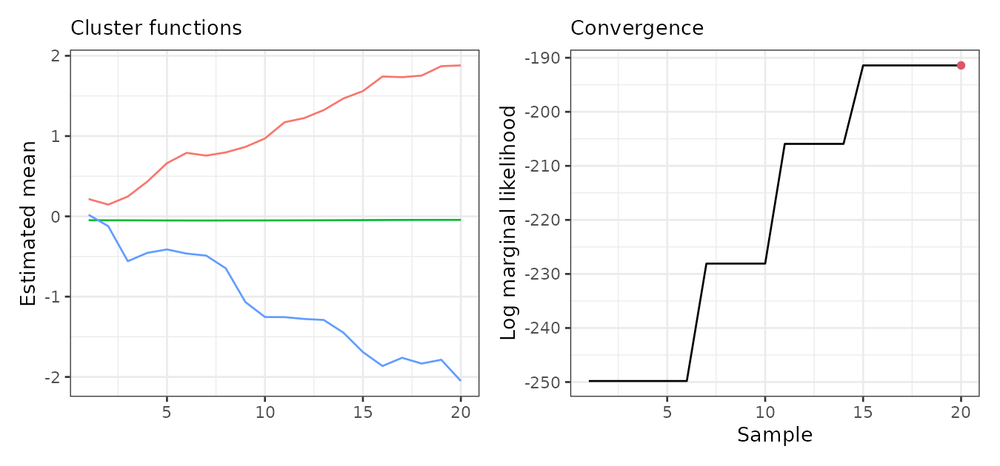
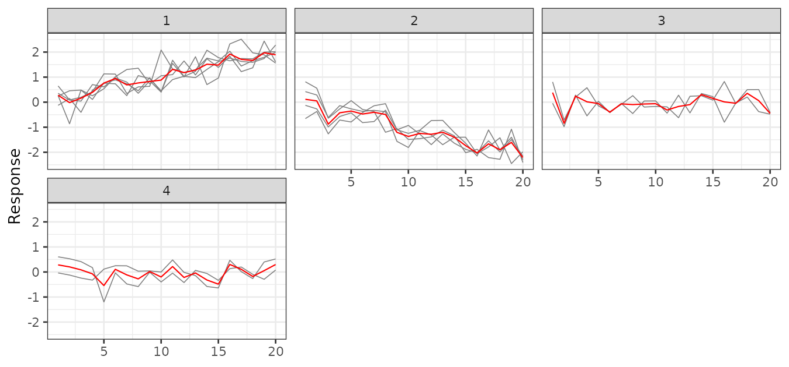

# Data frame interface

``` r

library(sfclust)
library(Matrix)
library(ggplot2)
```

The [`sfclust()`](../reference/sfclust.md) generic also accepts a
**long-format data frame** together with an explicit **adjacency
matrix**. This interface is useful when your data is not a `stars`
object — for example when you already have a processed table, or spatial
units that cannot be represented as a regular `stars` grid. It’s also
useful when you need a custom adjacency structure derived from a GIS
tool or domain knowledge, rather than the automatically-detected one.

## Data structure

Two identifier columns are always required:

- `id`: unique row index (1 to $`n_s \times n_t`$).
- `ids`: spatial unit index (integer, 1 to $`n_s`$).

A functional dimension column is also needed whenever your `formula`
references it:

- `<dimname>`: functional dimension index; any column name chosen by the
  user, provided it matches the `fnames` argument.

We construct a synthetic dataset with 13 regions observed over 20 time
steps. The regions are grouped into three latent clusters, each
following a distinct linear trend: increasing, flat, and decreasing.

``` r

set.seed(42)
ns <- 13L; nt <- 20L

# identifiers
df <- data.frame(
  id      = seq_len(ns * nt),
  ids     = rep(seq_len(ns), nt),
  time = rep(seq_len(nt), each = ns)
)

# membership and cluster slopes
membership <- c(1, 1, 1, 1, 1, 2, 2, 2, 2, 3, 3, 3, 3)
slopes  <- c(0.10, 0.00, -0.10)

# response
df <- transform(df, y = rnorm(ns * nt, mean = slopes[membership[ids]] * time, sd = 0.4))
head(df)
```

    #>   id ids time           y
    #> 1  1   1    1  0.64838338
    #> 2  2   2    1 -0.12587927
    #> 3  3   3    1  0.24525136
    #> 4  4   4    1  0.35314504
    #> 5  5   5    1  0.26170733
    #> 6  6   6    1 -0.04244981

## Adjacency matrix

The adjacency matrix encodes which regions are considered neighbours. It
must be a symmetric matrix of size $`n_s \times n_s`$. In practice this
matrix typically comes from a GIS tool (e.g. via
[`sf::st_touches()`](https://r-spatial.github.io/sf/reference/geos_binary_pred.html)),
a domain-specific connectivity table, or any other external source. Here
we define an arbitrary irregular neighbourhood structure for the 13
regions:

``` r

# Arbitrary adjacency (upper triangle only; symmetric = TRUE mirrors it)
# Within-cluster links: {1-5}, {6-9}, {10-13}; cross-cluster links: 5-6, 9-10
i_idx <- c(1, 2, 3, 4, 1, 3,  6, 7, 8, 6,  10, 11, 12, 10,  5,  9)
j_idx <- c(2, 3, 4, 5, 5, 5,  7, 8, 9, 9,  11, 12, 13, 13,  6, 10)
adj <- sparseMatrix(i = i_idx, j = j_idx, x = 1L,
                    dims = c(ns, ns), symmetric = TRUE)
```

## Clustering

Pass the adjacency matrix via `adjacency`, the starting number of
clusters via `nclust`, and the name of the functional dimension via
`fnames`. All other arguments are forwarded to
[`INLA::inla`](https://rdrr.io/pkg/INLA/man/inla.html). For finer
control over the initial partition (e.g. fixing specific cluster
assignments), you can pre-compute it with
[`genclust()`](../reference/genclust.md) and pass the result via
`graphdata` instead.

``` r

set.seed(42)
result <- sfclust(
  df, adjacency = adj, nclust = 5, fnames = "time",
  formula = y ~ f(time, model = "rw1"),
  family  = "gaussian",
  niter = 20, burnin = 0, thin = 1, nmessage = 5
)
```

    #> Iteration 5: clusters = 6, births = 1, deaths = 0, changes = 0, hypers = 1, log_mlike = -249.806942262186

    #> Iteration 10: clusters = 5, births = 1, deaths = 1, changes = 0, hypers = 1, log_mlike = -228.082701335373

    #> 
    #>  *** inla.core.safe:  rerun to try to solve negative eigenvalue(s) in the Hessian 
    #> 
    #>  *** inla.core.safe:  rerun to try to solve negative eigenvalue(s) in the Hessian

    #> Iteration 15: clusters = 4, births = 1, deaths = 2, changes = 0, hypers = 1, log_mlike = -205.932598641884

    #> Iteration 20: clusters = 3, births = 1, deaths = 3, changes = 0, hypers = 1, log_mlike = -191.412243242203

``` r

result
```

    #> Within-cluster formula:
    #> y ~ f(time, model = "rw1")
    #> 
    #> Clustering hyperparameters:
    #>   log(1-q)      birth      death     change      hyper 
    #> -0.6931472  0.4250000  0.4250000  0.1000000  0.0500000 
    #> 
    #> Clustering movement counts:
    #>  births  deaths changes  hypers 
    #>       1       3       0       1 
    #> 
    #> Log marginal likelihood (sample 20 out of 20): -191.4122

The returned object has class `sfclust` (without the `sfclust_stars`
subclass). The print output is identical to the stars interface:
formula, clustering hyperparameters, movement counts, and log marginal
likelihood.

## Results

The summary shows the number of regions per cluster at the final
iteration.

``` r

summary(result, sort = TRUE)
```

    #> Summary for clustering sample 20 out of 20 
    #> 
    #> Within-cluster formula:
    #> y ~ f(time, model = "rw1")
    #> 
    #> Counts per cluster:
    #> 1 2 3 
    #> 5 4 4 
    #> 
    #> Log marginal likelihood:  -191.4122

[`fitted()`](https://rdrr.io/r/stats/fitted.values.html) returns a
**data frame** instead of a `stars` object, with one row per observation
and columns for the cluster assignment, the linear predictor (`mean`,
`sd`, quantiles), and the cluster-level mean (`mean_cluster`):

``` r

df_fit <- fitted(result, sort = TRUE)
head(df_fit[c("id", "ids", "time", "cluster", "mean", "mean_cluster")])
```

    #>   id ids time cluster        mean mean_cluster
    #> 1  1   1    1       1  0.21601255   0.21601255
    #> 2  2   2    1       1  0.21601255   0.21601255
    #> 3  3   3    1       1  0.21601255   0.21601255
    #> 4  4   4    1       1  0.21601255   0.21601255
    #> 5  5   5    1       1  0.21601255   0.21601255
    #> 6  6   6    1       2 -0.04776628  -0.04776628

The usual plot helpers are available. Since there is no spatial
geometry, [`plot()`](https://rdrr.io/r/graphics/plot.default.html) has
no map panel — `which = 1:2` refers to the cluster functions and the log
marginal likelihood:

``` r

plot(result, sort = TRUE)
```



``` r

plot_clusters_series(result, y, sort = TRUE) +
  facet_wrap(~ cluster, ncol = 3) +
  labs(y = "Response")
```


