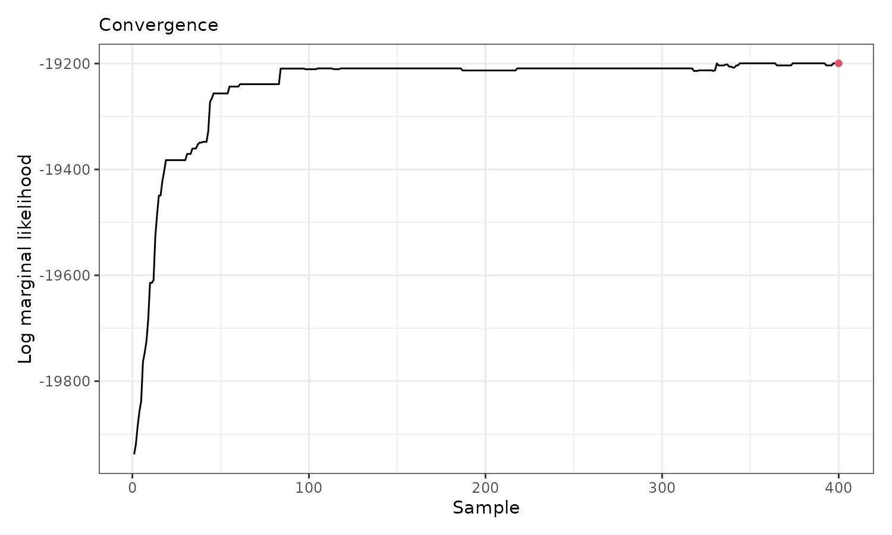
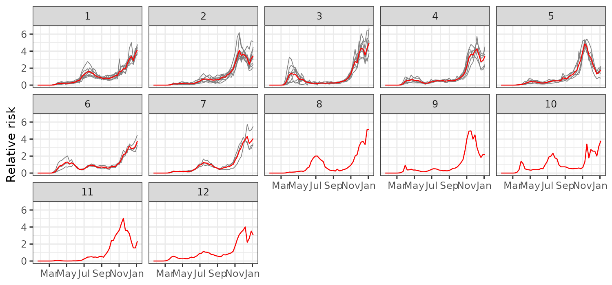
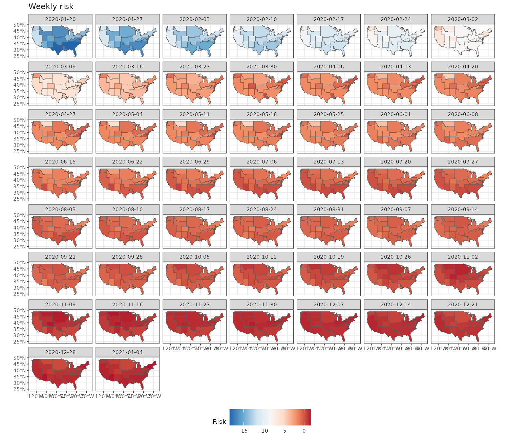

# Weekly relative risk of COVID-19 in US states

In this vignette, we use `sfclust` to identify US states with similar
weekly relative risk of COVID-19 during 2020.

## Load packages and data

``` r

library(sfclust)
library(stars)
library(ggplot2)
library(dplyr)
```

The data for this application is available on our GitHub repository:
<https://github.com/ErickChacon/sfclust/blob/main/tools/data/usacovid.rds>.
It contains weekly data for 49 states, including the number of cases,
the population, and the number of expected cases.

``` r

link <- "https://github.com/ErickChacon/sfclust/blob/main/tools/data/"
usacovid <- readRDS(gzcon(url(paste0(link, "usacovid.rds?raw=true"))))
usacovid
```

    #> stars object with 2 dimensions and 3 attributes
    #> attribute(s):
    #>                     Min.      1st Qu.       Median         Mean     3rd Qu.
    #> cases             0.0000      387.000     2921.000     8862.738     8653.00
    #> population  4072852.0000 13333320.000 32645312.000 45820355.000 51060352.00
    #> expected        175.6667     2934.647     6013.216     8862.738    11052.02
    #>                     Max.
    #> cases          316910.00
    #> population  274041320.00
    #> expected        55213.08
    #> dimension(s):
    #>       from to     offset  delta refsys point
    #> time     1 51 2020-01-20 7 days   Date FALSE
    #> space    1 49         NA     NA WGS 84 FALSE
    #>                                                              values
    #> time                                                           NULL
    #> space MULTIPOLYGON (((-88.05338...,...,MULTIPOLYGON (((-111.0467...

Note that the dimension names are `space` and `time`. Since the spatial
dimension is not the default `"geometry"`, you must specify
`spnames = "space"` when using [`sfclust()`](../reference/sfclust.md).

## Exploratory analysis

We begin by visualizing the weekly relative risk of COVID-19 across the
49 states. Higher risk levels are observed toward the end of the year.

``` r

ggplot() +
    geom_stars(aes(fill = cases/expected), data = usacovid) +
    facet_wrap(~ time, ncol = 7) +
    scale_fill_distiller(palette = "RdBu") +
    labs(fill = "Relative risk") +
    theme_bw(base_size = 7) +
    theme(legend.position = "bottom")
```


We can also examine the time series of relative risk for each state.
Peaks are evident around April, July, and especially December.

``` r

usacovid |>
    st_set_dimensions("space", values = 1:ncol(usacovid)) |>
    as_tibble() |>
    ggplot() +
    geom_line(aes(time, cases/expected, group = space, color = factor(space)), linewidth = 0.3) +
    geom_point(aes(time, cases/expected, group = space, color = factor(space))) +
    labs(y = "Relative risk", x = NULL) +
    theme_bw() +
    theme(legend.position = "none")
```


## Spatial clustering

### Model fitting

We assume that the logarithm of the relative risk can be explained by:

1.  A polynomial trend over `time`
2.  An autoregressive effect over `id_time`
3.  An unstructured random effect across states and times (`id`)

We begin with one cluster per state (49 clusters total). Be sure to set
the spatial dimension name: `spnames = "space"`. Two additional
arguments deserve mention: `nsave` periodically saves intermediate
results to disk every 1000 iterations (useful for long runs);
`control.inla` disables the variational Bayes approximation
(`control.vb`) and uses empirical Bayes integration
(`int.strategy = "eb"`) for numerical stability with this model.

``` r

set.seed(123)
formula <- cases ~ 1 + poly(time, 3) + f(id_time, model = "ar1") + f(id)
result <- sfclust(usacovid, nclust = 49, spnames = "space",
    formula = formula, family = "poisson", E = expected,
    niter = 4000, burnin = 0, thin = 10, nmessage = 10, nsave = 1000,
    control.inla = list(control.vb = list(enable = FALSE), int.strategy = "eb"))
result
```

    #> Within-cluster formula:
    #> cases ~ 1 + poly(time, 3) + f(id_time, model = "ar1") + f(id)
    #> 
    #> Clustering hyperparameters:
    #>   log(1-q)      birth      death     change      hyper 
    #> -0.6931472  0.4250000  0.4250000  0.1000000  0.0500000 
    #> 
    #> Clustering movement counts:
    #>  births  deaths changes  hypers 
    #>      20      57      13     223 
    #> 
    #> Log marginal likelihood (sample 400 out of 400): -19199.61

Summary of clustering steps:

- 20 cluster splits
- 57 cluster merges
- 13 cluster composition changes
- 223 updates to the minimum spanning tree

400 samples were retained (after thinning) from 4000 iterations. The
final marginal likelihood was -19199.61.

### Results

``` r

summary(result, sort = TRUE)
```

    #> Summary for clustering sample 400 out of 400 
    #> 
    #> Within-cluster formula:
    #> cases ~ 1 + poly(time, 3) + f(id_time, model = "ar1") + f(id)
    #> 
    #> Counts per cluster:
    #>  1  2  3  4  5  6  7  8  9 10 11 12 
    #>  9  9  8  6  6  3  3  1  1  1  1  1 
    #> 
    #> Log marginal likelihood:  -19199.61

The [`summary()`](https://rdrr.io/r/base/summary.html) output shows that
7 out of 12 clusters contain more than one state. The two largest
clusters each include 9 states, while the remaining clusters are
smaller. In order to verify the adequacy of this clustering, we check
the convergence using the
[`plot()`](https://rdrr.io/r/graphics/plot.default.html) function with
option `which = 3`.

``` r

plot(result, which = 3)
```



The figure indicates that the log marginal likelihood improves
significantly within the first 100 samples (after thinning) and
stabilizes afterward from sample 200. Now, we can visualize the spatial
cluster assignment and the predicted mean for each cluster:

``` r

plot(result, which = 1:2, legend = TRUE, sort = TRUE)
```


The [`plot()`](https://rdrr.io/r/graphics/plot.default.html) output
indicates that:

- The largest cluster is in the southwestern US, followed by clusters in
  central and northwestern regions.
- Mean relative risk increases gradually across the year, with different
  peaks per cluster.

The `fitted` function returns a `stars` object containing prediction
summaries: the `cluster` assignment, the `mean_cluster` linear
predictor, and its inverse (`mean_cluster_inv`).

``` r

us_fit <- fitted(result, sort = TRUE)
us_fit
```

    #> stars object with 2 dimensions and 17 attributes
    #> attribute(s):
    #>                            Min.       1st Qu.        Median          Mean
    #> id                 1.000000e+00  6.255000e+02  1.250000e+03  1.250000e+03
    #> ids                1.000000e+00  1.300000e+01  2.500000e+01  2.500000e+01
    #> id_time            1.000000e+00  1.300000e+01  2.600000e+01  2.600000e+01
    #> cases              0.000000e+00  3.870000e+02  2.921000e+03  8.862738e+03
    #> population         4.072852e+06  1.333332e+07  3.264531e+07  4.582036e+07
    #> expected           1.756667e+02  2.934647e+03  6.013216e+03  8.862738e+03
    #> sid                1.000000e+00  1.300000e+01  2.500000e+01  2.500000e+01
    #> mean              -1.846121e+01 -1.849255e+00 -6.845798e-01 -2.092944e+00
    #> sd                 1.776350e-03  1.074461e-02  1.849102e-02  1.406044e-01
    #> 0.025quant        -2.140169e+01 -1.941015e+00 -7.270349e-01 -2.368523e+00
    #> 0.5quant          -1.846121e+01 -1.849255e+00 -6.845798e-01 -2.092944e+00
    #> 0.975quant        -1.571592e+01 -1.749603e+00 -6.404880e-01 -1.817364e+00
    #> mode              -1.846121e+01 -1.849255e+00 -6.845798e-01 -2.092944e+00
    #> mean_inv           9.602801e-09  1.573544e-01  5.043021e-01  1.000052e+00
    #> cluster            1.000000e+00  2.000000e+00  3.000000e+00  3.959184e+00
    #> mean_cluster      -1.846118e+01 -1.773575e+00 -6.845124e-01 -2.092944e+00
    #> mean_cluster_inv   9.603101e-09  1.697268e-01  5.043361e-01  9.647859e-01
    #>                        3rd Qu.         Max.
    #> id                1.874500e+03 2.499000e+03
    #> ids               3.700000e+01 4.900000e+01
    #> id_time           3.900000e+01 5.100000e+01
    #> cases             8.653000e+03 3.169100e+05
    #> population        5.106035e+07 2.740413e+08
    #> expected          1.105202e+04 5.521308e+04
    #> sid               3.700000e+01 4.900000e+01
    #> mean              2.489280e-01 1.898842e+00
    #> sd                5.031968e-02 2.126853e+00
    #> 0.025quant        2.254447e-01 1.841685e+00
    #> 0.5quant          2.489280e-01 1.898842e+00
    #> 0.975quant        2.762607e-01 1.955999e+00
    #> mode              2.489280e-01 1.898842e+00
    #> mean_inv          1.282653e+00 6.678155e+00
    #> cluster           5.000000e+00 1.200000e+01
    #> mean_cluster      1.505794e-01 1.634359e+00
    #> mean_cluster_inv  1.162514e+00 5.126173e+00
    #> dimension(s):
    #>       from to     offset  delta refsys point
    #> time     1 51 2020-01-20 7 days   Date FALSE
    #> space    1 49         NA     NA WGS 84 FALSE
    #>                                                              values
    #> time                                                           NULL
    #> space MULTIPOLYGON (((-88.05338...,...,MULTIPOLYGON (((-111.0467...

### Empirical risk per cluster

We use the cluster assignments to analyze and visualize the empirical
relative risk per cluster. This can easily be done with the
[`plot_clusters_series()`](../reference/plot_clusters_series.md)
function:

``` r

plot_clusters_series(result, cases/expected, sort = TRUE, clusters = 1:12) +
  facet_wrap(~ cluster, ncol = 5) +
  scale_x_date(date_breaks = "2 months", date_labels =  "%b") +
  labs(y = "Relative risk")
```



This figure shows distinct epidemic dynamics by cluster:

- Cluster 1 shows an increasing risk with a peak in July–August.
- Cluster 2 peaks around November–December, with a decline by year-end.
- Cluster 3 shows early activity around March and high risk near
  January.
- Clusters 4–7 follow various intermediate trends.
- Clusters 8–12 exhibit less typical behavior.

To complement the empirical view, we can also visualize the
cluster-level mean log relative risk over time using the `fitted`
function with `aggregate = TRUE`. This returns a `stars` object with one
geometry per cluster, making it straightforward to produce a faceted map
of the smoothed cluster predictions:

``` r

pred <- fitted(result, sort = TRUE, aggregate = TRUE)
ggplot() +
    geom_stars(aes(fill = mean_cluster), data = pred) +
    facet_wrap(~ time, ncol = 7) +
    scale_fill_distiller(palette = "RdBu") +
    labs(title = "Weekly risk", fill = "Risk") +
    theme_bw(base_size = 7) +
    theme(legend.position = "bottom")
```


