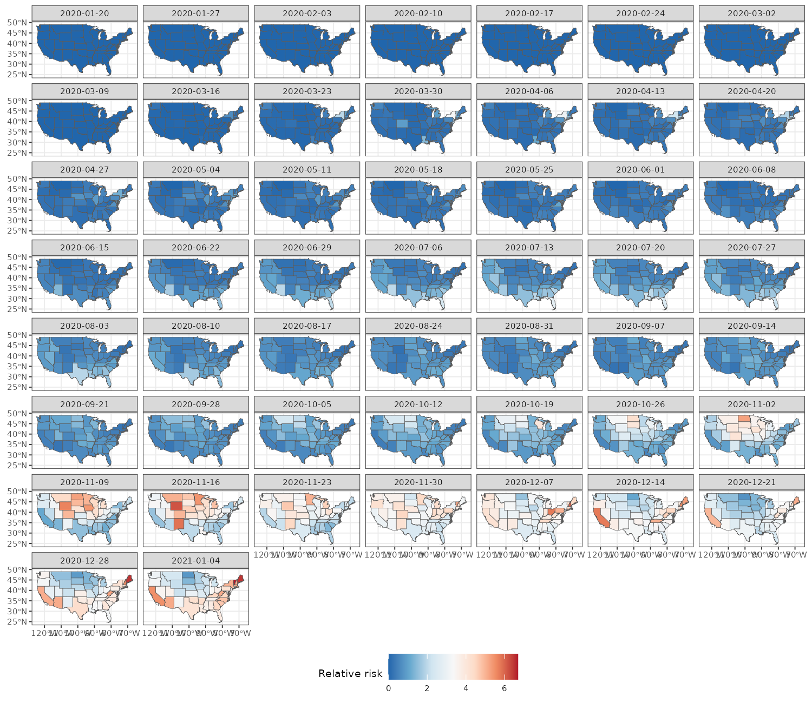
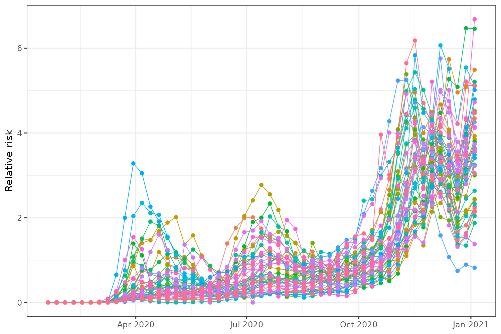
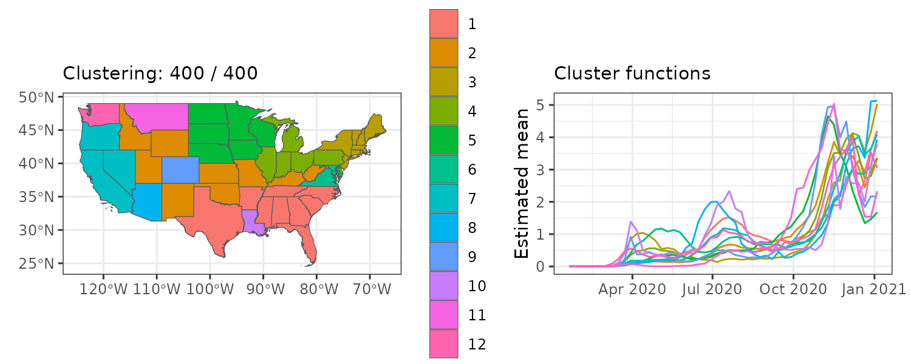
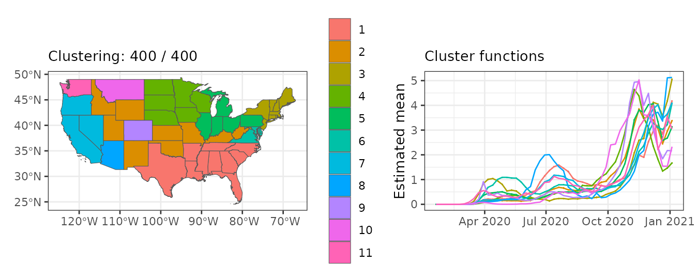
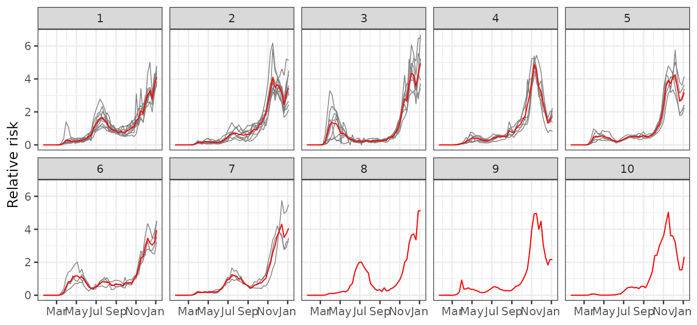

# Weekly relative risk of COVID-19 in US states

In this vignette, we use `sfclust` to identify US states with similar
weekly relative risk of Covid-19 during 2020.

## Load packages and data

``` r

library(sfclust)
library(stars)
library(ggplot2)
library(dplyr)
```

The data for this application is available on our GitHub repository:
<https://github.com/ErickChacon/sfclust/blob/main/tools/data/usacovid.rds>.
It contains weekly data for 49 states, including the number of cases,
the population, and the number of expected cases.

``` r

link <- "https://github.com/ErickChacon/sfclust/blob/main/tools/data/"
usacovid <- readRDS(gzcon(url(paste0(link, "usacovid.rds?raw=true"))))
usacovid
```

    #> stars object with 2 dimensions and 3 attributes
    #> attribute(s):
    #>                     Min.      1st Qu.       Median         Mean     3rd Qu.
    #> cases             0.0000      387.000     2921.000     8862.738     8653.00
    #> population  4072852.0000 13333320.000 32645312.000 45820355.000 51060352.00
    #> expected        175.6667     2934.647     6013.216     8862.738    11052.02
    #>                     Max.
    #> cases          316910.00
    #> population  274041320.00
    #> expected        55213.08
    #> dimension(s):
    #>       from to     offset  delta refsys point
    #> time     1 51 2020-01-20 7 days   Date FALSE
    #> space    1 49         NA     NA WGS 84 FALSE
    #>                                                              values
    #> time                                                           NULL
    #> space MULTIPOLYGON (((-88.05338...,...,MULTIPOLYGON (((-111.0467...

Note that the dimension names are `space` and `time`. Since `sfclust`
expects them to be `c("geometry", "time")`, you must specify the
`stnames` argument when using the function
[`sfclust()`](../reference/sfclust.md) of the package.

## Exploratory analysis

We begin by visualizing the weekly relative risk of Covid-19 across the
49 states. Higher risk levels are observed toward the end of the year.

``` r

ggplot() +
    geom_stars(aes(fill = cases/expected), data = usacovid) +
    facet_wrap(~ time) +
    scale_fill_distiller(palette = "RdBu") +
    labs(fill = "Relative risk") +
    theme_bw() +
    theme(legend.position = "bottom")
```



We can also examine the time series of relative risk for each state.
Peaks are evident around April, July, and especially December.

``` r

usacovid |>
    st_set_dimensions("space", values = 1:ncol(usacovid)) |>
    as_tibble() |>
    ggplot() +
    geom_line(aes(time, cases/expected, group = space, color = factor(space)), linewidth = 0.3) +
    geom_point(aes(time, cases/expected, group = space, color = factor(space))) +
    labs(y = "Relative risk", x = NULL) +
    theme_bw() +
    theme(legend.position = "none")
```



## Spatial clustering

### Model fitting

We assume that the logarithm of the relative risk can be explained by:

1.  A polynomial trend over `time`
2.  An autoregressive effect over `idt`
3.  An unstructured random effect across states and times (`id`)

We begin with one cluster per state (49 clusters total). Be sure to set
the dimension names: `stnames = c("space", "time")`.

``` r

formula <- cases ~ 1 + poly(time, 3) + f(idt, model = "ar1") + f(id)
geodata <- genclust(st_geometry(usacovid), nclust = 49)

set.seed(123)
result <- sfclust(usacovid, graphdata = geodata, stnames = c("space", "time"),
    formula = formula, family = "poisson", E = expected,
    niter = 4000, burnin = 0, thin = 10, nmessage = 10, nsave = 100,
    path_save = "usacovid-mcmc.rds")
result
```

    #> Within-cluster formula:
    #> cases ~ 1 + poly(time, 3) + f(idt, model = "ar1") + f(id)
    #> 
    #> Clustering hyperparameters:
    #>   log(1-q)      birth      death     change      hyper 
    #> -0.6931472  0.4250000  0.4250000  0.1000000  0.0500000 
    #> 
    #> Clustering movement counts:
    #>  births  deaths changes  hypers 
    #>      36      74      12     187 
    #> 
    #> Log marginal likelihood (sample 400 out of 400): -19196.71

Summary of clustering steps:

- 36 cluster splits
- 74 cluster merges
- 12 cluster composition changes
- 187 updates to the minimum spanning tree

400 samples were retained (after thinning) from 4000 iterations. The
final marginal likelihood was -19196.77.

### Results

``` r

summary(result, sort = TRUE)
```

    #> Summary for clustering sample 400 out of 400 
    #> 
    #> Within-cluster formula:
    #> cases ~ 1 + poly(time, 3) + f(idt, model = "ar1") + f(id)
    #> 
    #> Counts per cluster:
    #>  1  2  3  4  5  6  7  8  9 10 11 
    #> 10  9  8  6  5  4  3  1  1  1  1 
    #> 
    #> Log marginal likelihood:  -19196.71

The [`summary()`](https://rdrr.io/r/base/summary.html) output shows that
7 out of 11 clusters contain more than one state. The largest cluster
includes 10 states, while the second includes 9, and so on. In order to
verify the adequacy of this clustering, we check the convergence using
the [`plot()`](https://rdrr.io/r/graphics/plot.default.html) function
with option `which = 3`.

``` r

plot(result, which = 3)
```



The figure indicates that the marginal likelihood improves significantly
within the first 100 iterations (after thinning) and stabilizes
afterward from sample 200. Now, we can visualize the spatial cluster
assignment and the predicted mean for each cluster:

``` r

plot(result, which = 1:2, legend = TRUE, sort = TRUE)
```



The [`plot()`](https://rdrr.io/r/graphics/plot.default.html) output
indicates that:

- The largest cluster is in the southwestern US, followed by clusters in
  central and northwestern regions.
- Mean relative risk increases gradually across the year, with different
  peaks per cluster.

The `fitted` function return an `stars` object with prediction summaries
after fitting, the `cluster` assignment, the `mean_cluster` linear
predictor, the inverse of the linear predictor (`mean_cluster_inv`).

``` r

us_fit <- fitted(result, sort = TRUE)
us_fit
```

    #> stars object with 2 dimensions and 10 attributes
    #> attribute(s):
    #>                            Min.     1st Qu.     Median       Mean    3rd Qu.
    #> mean              -1.875691e+01 -1.84907558 -0.6834142 -2.1247489 0.24891764
    #> sd                 1.776338e-03  0.01074621  0.0184909  0.1442848 0.05030386
    #> 0.025quant        -2.177483e+01 -1.94097604 -0.7270388 -2.4117157 0.22542558
    #> 0.5quant          -1.874348e+01 -1.84907552 -0.6834142 -2.1234705 0.24891764
    #> 0.975quant        -1.581470e+01 -1.74954612 -0.6387514 -1.8450015 0.27627810
    #> mode              -1.874333e+01 -1.84907552 -0.6834142 -2.1231750 0.24891764
    #> mean_inv           7.144593e-09  0.15738259  0.5048903  1.0000604 1.28263941
    #> cluster            1.000000e+00  2.00000000  3.0000000  3.7551020 5.00000000
    #> mean_cluster      -1.875688e+01 -1.76075551 -0.6846120 -2.1258073 0.15042338
    #> mean_cluster_inv   7.144842e-09  0.17191493  0.5042859  0.9636620 1.16233361
    #>                        Max.
    #> mean               1.898851
    #> sd                 1.847165
    #> 0.025quant         1.841667
    #> 0.5quant           1.898851
    #> 0.975quant         1.956034
    #> mode               1.898851
    #> mean_inv           6.678214
    #> cluster           11.000000
    #> mean_cluster       1.634518
    #> mean_cluster_inv   5.126985
    #> dimension(s):
    #>       from to     offset  delta refsys point
    #> time     1 51 2020-01-20 7 days   Date FALSE
    #> space    1 49         NA     NA WGS 84 FALSE
    #>                                                              values
    #> time                                                           NULL
    #> space MULTIPOLYGON (((-88.05338...,...,MULTIPOLYGON (((-111.0467...

### Empirical risk per cluster

We use the cluster assignments to analyze and visualize the empirical
relative risk per cluster. This can easily be done with the
`plot_cluster_series()` function:

``` r

plot_clusters_series(result, cases/expected, sort = TRUE, clusters = 1:10) +
  facet_wrap(~ cluster, ncol = 5) +
  scale_x_date(date_breaks = "2 months", date_labels =  "%b") +
  labs(y = "Relative risk")
```



This figure shows distinct epidemic dynamics by cluster:

- Cluster 1 shows an increasing risk with a peak in July–August.
- Cluster 2 peaks around November–December, with a decline by year-end.
- Cluster 3 shows early activity around March and high risk near
  January.
- Clusters 4–7 follow various intermediate trends.
- Clusters 8–11 exhibit less typical behavior.
