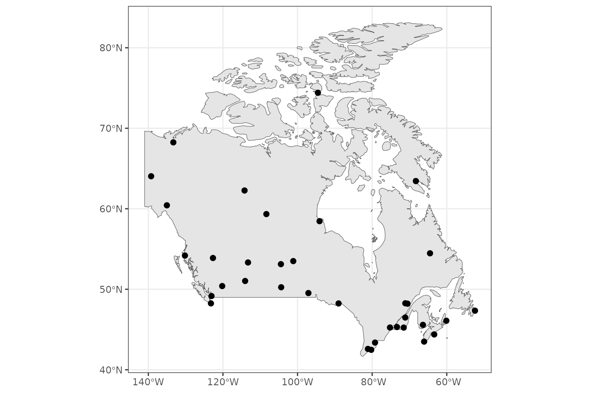
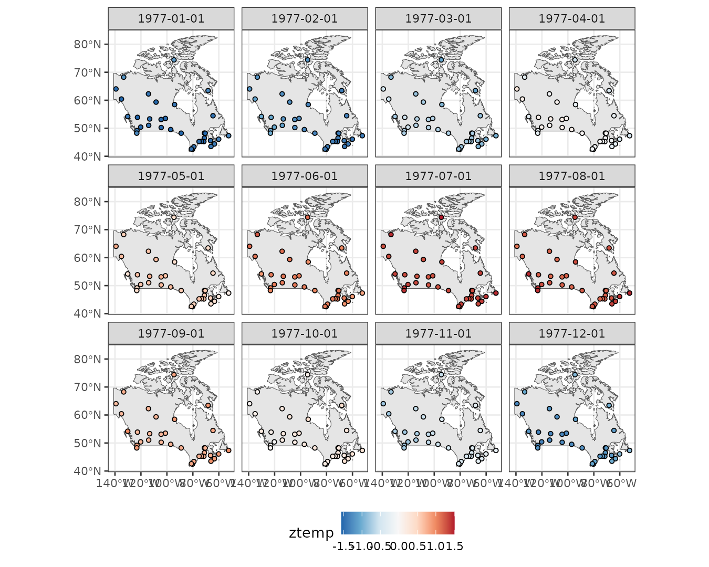
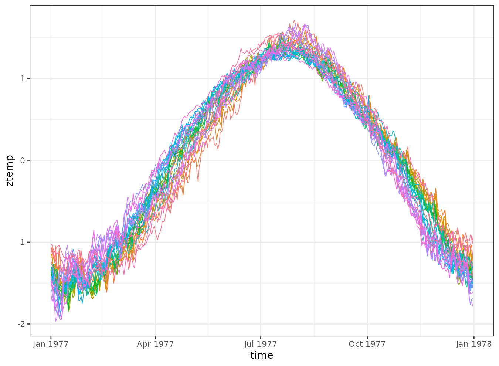
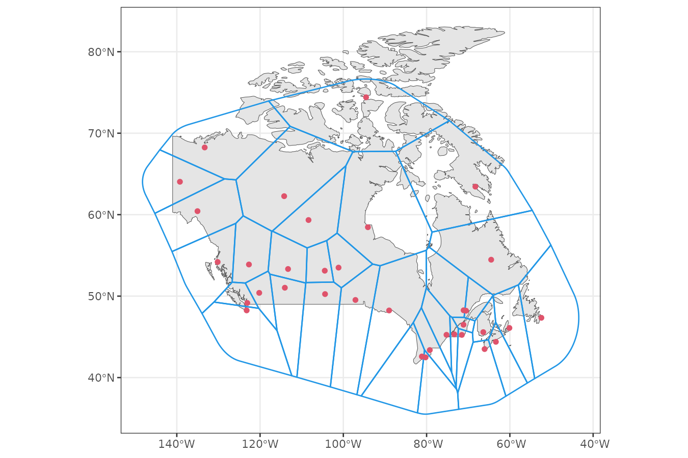
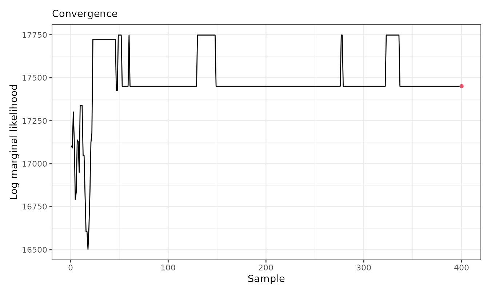
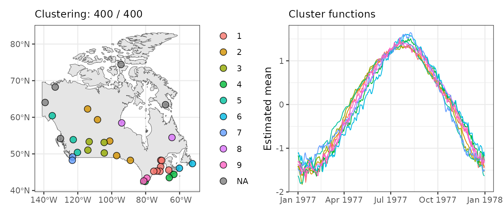
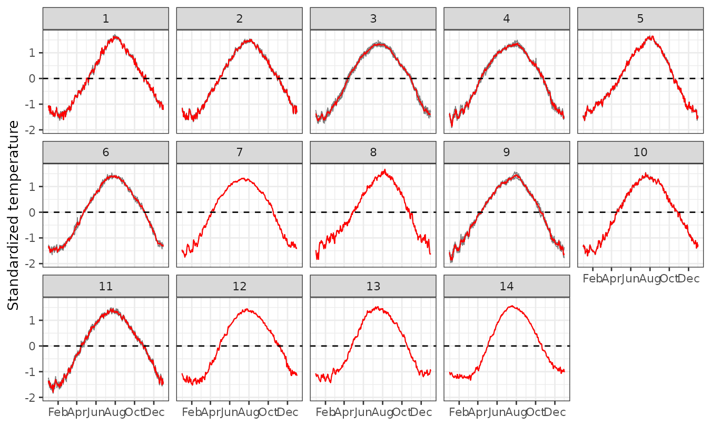

# Standardized daily temperature at Canadian stations

In this vignette, we use the `sfclust` package to cluster Canadian
weather stations based on their standardized daily temperatures averaged
over the period 1960–1994.

## Load packages and data

``` r

library(sfclust)
library(stars)
library(ggplot2)
library(dplyr)
```

We use the `CanadianWeather` dataset from the `fda` package, which is
commonly used in functional data analysis. This dataset is a list
containing daily temperature data per station, along with metadata such
as station coordinates. For the background map we use the `maps`
package, which bundles country and province boundaries directly.

``` r

canada <- sf::st_as_sf(maps::map("world", regions = "Canada", plot = FALSE, fill = TRUE))
data(CanadianWeather, package = "fda")
names(CanadianWeather)
```

    #> [1] "dailyAv"       "place"         "province"      "coordinates"  
    #> [5] "region"        "monthlyTemp"   "monthlyPrecip" "geogindex"

## Prepare data

### Create stars data

First, we convert the station coordinates to an `sf` object and
visualize their locations.

``` r

stations <- as.data.frame(CanadianWeather$coordinates) |>
  mutate(longitud = - `W.longitude`) |>
  rename(latitud = "N.latitude") |>
  select(longitud, latitud) |>
  st_as_sf(coords = c("longitud", "latitud"), crs = st_crs(4326))

ggplot() +
  geom_sf(data = canada) +
  geom_sf(data = stations, size = 2) +
  theme_bw()
```



We standardize the temperature per station to focus clustering on the
functional shape of the time series rather than their absolute values.
We then convert the data to a `stars` object with `geometry` and `time`
dimensions, as required by the function
[`sfclust()`](../reference/sfclust.md).

``` r

time <- seq(as.Date("1977-01-01"), as.Date("1977-12-31"), by = "1 day")
canweather <- st_as_stars(
    temp = t(CanadianWeather$dailyAv[, , 1]),
    ztemp = t(scale(CanadianWeather$dailyAv[, , 1])),
    dimensions = st_dimensions(geometry = st_geometry(stations), time = time, point = TRUE)
)
canweather
```

    #> stars object with 2 dimensions and 2 attributes
    #> attribute(s):
    #>              Min.    1st Qu.     Median          Mean   3rd Qu.      Max.
    #> temp   -34.800000 -6.7000000 4.10000000  1.877659e+00 12.600000 22.800000
    #> ztemp   -1.967879 -0.9821809 0.09676872 -2.067071e-19  0.960108  1.711485
    #> dimension(s):
    #>          from  to     offset  delta refsys point
    #> geometry    1  35         NA     NA WGS 84  TRUE
    #> time        1 365 1977-01-01 1 days   Date  TRUE
    #>                                                 values
    #> geometry POINT (-52.43 47.34),...,POINT (-94.54 74.41)
    #> time                                              NULL

### Exploratory analysis

Let’s explore monthly averages of standardized temperatures. Higher
standardized temperatures appear in northern stations during July, while
lower values are observed in southern stations in January.

``` r

monthdata <- aggregate(canweather, by = "month", FUN = mean)
ggplot() +
  geom_sf(data = canada) +
  geom_stars(aes(fill = ztemp), monthdata, shape = 21, size = 1.3) +
  facet_wrap(~ time) +
  scale_fill_distiller(palette = "RdBu") +
  theme_bw() +
  theme(legend.position = "bottom")
```



We can also visualize the temperature trends over time for each station.
Although the overall shape is similar, there are noticeable differences
in the timing of the rise and fall of temperatures across stations.

``` r

canweather |>
  st_set_dimensions("geometry", values = 1:nrow(canweather)) |>
  as_tibble() |>
    ggplot() +
    geom_line(aes(time, ztemp, group = geometry, color = factor(geometry)), linewidth = 0.3) +
    theme_bw() +
    theme(legend.position = "none")
```



## Spatial clustering

### Create graph

The [`sfclust()`](../reference/sfclust.md) function assumes a `POLYGON`
geometry in the `stars` object to build a spatial adjacency graph.
However, our data uses `POINT` geometries representing station
locations. To create a spatial graph, we construct a Voronoi
tessellation that generates a polygon for each station.

``` r

stations2 <- st_transform(stations, st_crs(3857))

# create boundary
boundary <- st_convex_hull(st_union(stations2)) |>
  st_buffer(units::set_units(1000, "km"))

# create polygons with voronoi
domain <- st_cast(st_voronoi(st_union(stations2), boundary)) |>
  st_intersection(boundary)

# reorganize the polygons to match stations
domain <- domain[as.numeric(st_within(stations2, domain))] |>
  st_transform(st_crs(stations))

ggplot() +
  geom_sf(data = canada) +
  geom_sf(data = domain, color = 4, linewidth = 0.5, fill = NA) +
  geom_sf(data = stations, color = 2) +
  theme_bw()
```



### Model fitting

Based on the previously observed trends, we model the standardized
temperature as a function of:

1.  A polynomial trend over `time`.
2.  A random walk to capture autocorrelated temporal variation over
    `id_time`.

We initialize with 35 clusters—one per polygon—and set a strong penalty
(`logpen = -300`) to discourage overfitting and a large number of
clusters unless the log marginal likelihood improves by at least 300.

``` r

geodata <- genclust(as(st_touches(domain), "sparseMatrix"), nclust = 35)
set.seed(123)
result <- sfclust(canweather, graphdata = geodata, logpen = -300,
    formula = ztemp ~ poly(time, 2) + f(id_time, model = "rw1"),
    niter = 4000, burnin = 0, thin = 10, nmessage = 10, nsave = 1000,
    control.inla = list(control.vb = list(enable = FALSE)),
    path_save = file.path("canweather-mcmc.rds"))
result
```

    #> Within-cluster formula:
    #> ztemp ~ poly(time, 2) + f(id_time, model = "rw1")
    #> 
    #> Clustering hyperparameters:
    #> log(1-q)    birth    death   change    hyper 
    #> -300.000    0.425    0.425    0.100    0.050 
    #> 
    #> Clustering movement counts:
    #>  births  deaths changes  hypers 
    #>       8      29      22     202 
    #> 
    #> Log marginal likelihood (sample 400 out of 400): 17450.5

Over the course of sampling, 8 cluster additions, 29 merges, and 22
reassignments occurred. The log marginal likelihood reached a value of
17,450.5. After thinning, 400 samples were retained.

### Results

``` r

summary(result, sort = TRUE)
```

    #> Summary for clustering sample 400 out of 400 
    #> 
    #> Within-cluster formula:
    #> ztemp ~ poly(time, 2) + f(id_time, model = "rw1")
    #> 
    #> Counts per cluster:
    #>  1  2  3  4  5  6  7  8  9 10 11 12 13 14 
    #>  7  5  4  3  3  2  2  2  2  1  1  1  1  1 
    #> 
    #> Log marginal likelihood:  17450.5

According to the [`summary()`](https://rdrr.io/r/base/summary.html)
output, 9 out of 14 clusters have more than one member. The largest
clusters contain 7, 5, and 4 stations, respectively. To assess
convergence, we plot the log marginal likelihood trace:

``` r

plot(result, which = 3)
```



The plot shows that the log marginal likelihood stabilizes after the
first 100 (thinned) iterations. Below, we visualize the cluster
assignments and averaged fitted means:

``` r

gg1 <- plot_clusters_map(result, sort = TRUE, legend = TRUE, clusters = 1:9,
    geom_before = geom_sf(data = canada), size = 3, alpha = 0.8)
gg2 <- plot_clusters_fitted(result, sort = TRUE, clusters = 1:9, linewidth = 0.4)
gg1 + gg2
```



The largest cluster is in southeastern Canada and includes 7 closely
located stations. The second-largest is more dispersed, while the third
is in the southwest with 4 stations.

### Empirical standardized temperature per cluster

We use [`plot_clusters_series()`](../reference/plot_clusters_series.md)
to visualize the raw standardized temperature per cluster. The output
can be customized using `ggplot2` elements.

``` r

plot_clusters_series(result, ztemp) +
  geom_hline(yintercept = 0, linetype = 2) +
  facet_wrap(~ cluster, ncol = 5) +
  scale_x_date(date_breaks = "2 months", date_labels =  "%b") +
  labs(y = "Standardized temperature")
```



Panels 1–9 show the empirical standardized temperature per cluster for
those clusters that contain more than one station. The main differences
among these clusters lie in the initial shape of the curve, the speed of
increase, the shape and timing of the peak, and the behavior during the
decay phase. For example, clusters 1 and 2 exhibit a bell-shaped
pattern, while others, such as clusters 3 to 6, display a nearly linear
increase until reaching a maximum level. Panels 10–14 present the
empirical standardized temperature per cluster for those that contain
only one station. These single-station clusters tend to exhibit more
unique shapes, which not only distinguish them from the previous
multi-station clusters but also from each other.
