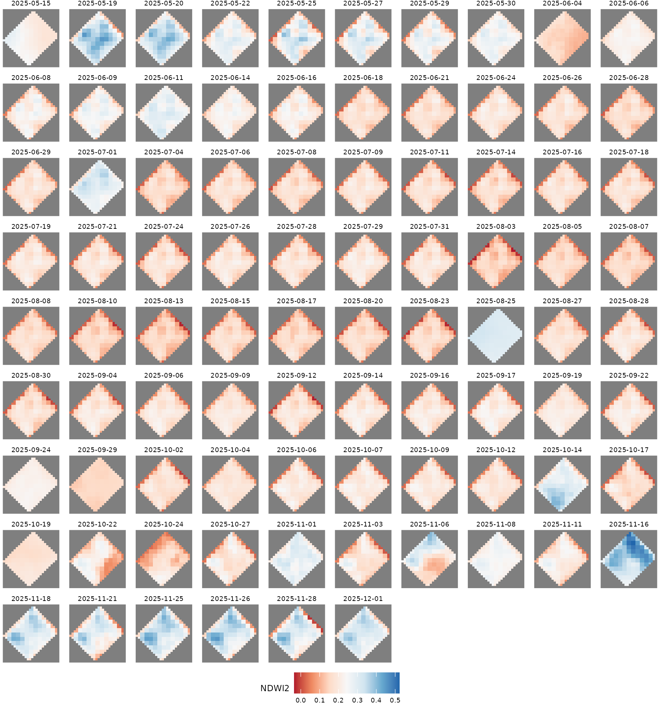
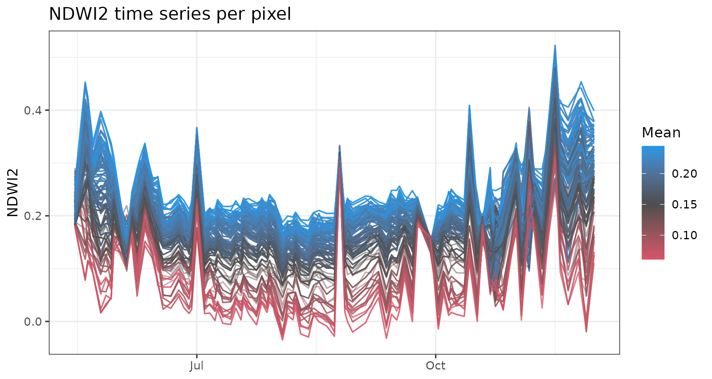
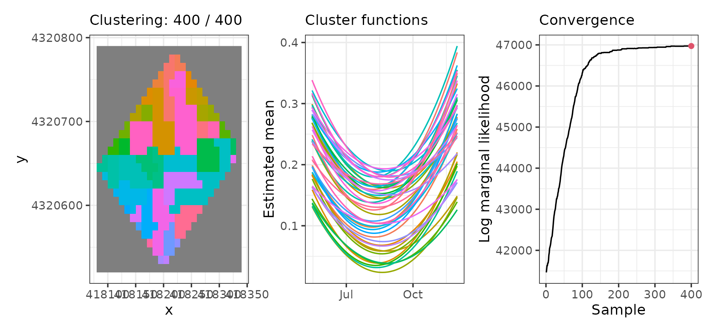
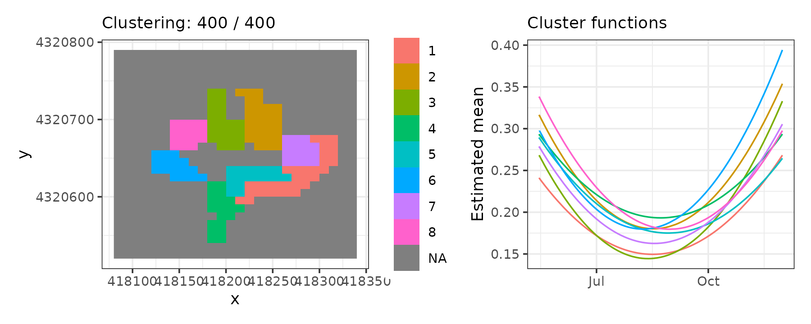
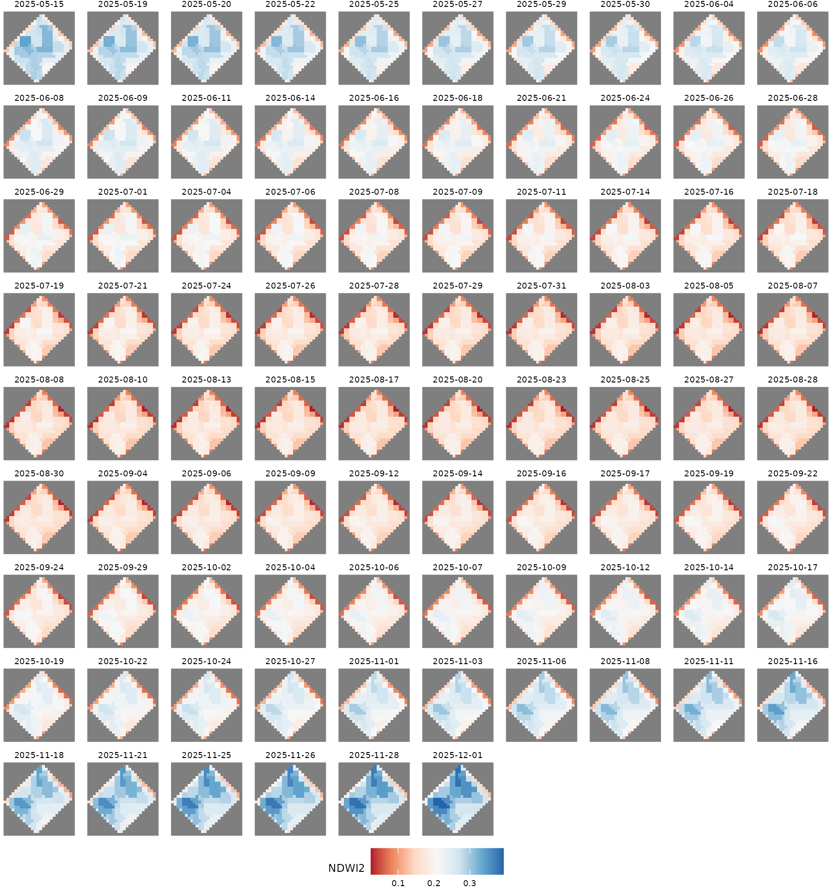
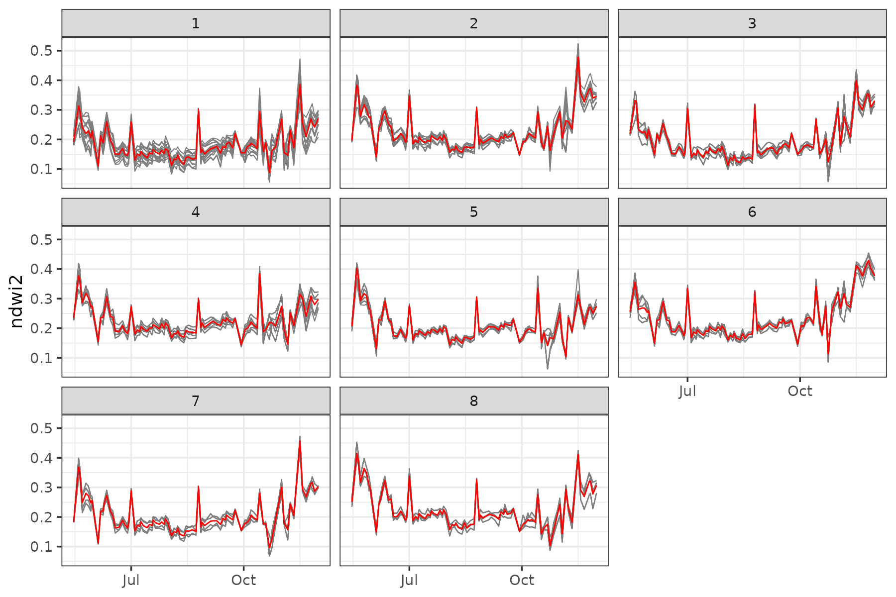

# Clustering raster spatio-temporal data (NDWI2)

In this vignette, we use the `sfclust` package with **raster**
spatio-temporal data. We cluster the functional trend of the NDWI2
vegetation water index (stored as the `ndwi2` column) for each cell in
the agricultural experiment in “El Chaparrillo” over the period
May–December 2025. The `ndwi2` values are derived from Sentinel-2
imagery and are bundled with the package as the `chapa` dataset.

## Load packages and data

``` r

library(sfclust)
library(stars)
library(ggplot2)
library(dplyr)
```

``` r

chapa
```

    #> stars object with 3 dimensions and 1 attribute
    #> attribute(s):
    #>               Min.   1st Qu.    Median     Mean   3rd Qu.      Max.   NAs
    #> ndwi2  -0.03494883 0.1527428 0.1872349 0.193792 0.2270235 0.5227525 31562
    #> dimension(s):
    #>      from to  offset delta                refsys point
    #> x       1 26  418080    10 WGS 84 / UTM zone 30N FALSE
    #> y       1 27 4320790   -10 WGS 84 / UTM zone 30N FALSE
    #> time    1 86      NA    NA                  Date    NA
    #>                         values x/y
    #> x                         NULL [x]
    #> y                         NULL [y]
    #> time 2025-05-15,...,2025-12-01

## Exploratory analysis

We start by visualizing the spatio-temporal behaviour of NDWI2.

``` r

ggplot() +
  geom_stars(aes(fill = ndwi2), data = chapa) +
  facet_wrap(~ time) +
  scale_fill_distiller(palette = "RdBu", direction = 1, na.value = "grey50") +
  labs(fill = "NDWI2") +
  theme_void(base_size = 7) +
  theme(legend.position = "bottom")
```



Notice that these data contain cells with NA values.
[`sfclust()`](../reference/sfclust.md) automatically builds a graph that
respects the connectivity of the cells and excludes the NA cells from
the clustering.

We can also plot the pixel-level time series to see how NDWI2 evolves
over the period.

``` r

chapa_aux <- as_tibble(chapa) |>
  filter(!is.na(ndwi2)) |>
  mutate(pixel = paste(x, y, sep = "-")) |>
  group_by(pixel) |>
  mutate(pixel_mean = mean(ndwi2)) |>
  ungroup()

ggplot(chapa_aux, aes(time, ndwi2, group = pixel)) +
  geom_line(aes(color = pixel_mean), alpha = 0.5, linewidth = 0.5) +
  scale_color_gradient2(low = 2, mid = "gray30", high = 4, midpoint = 0.15) +
  labs(title = "NDWI2 time series per pixel", x = NULL, y = "NDWI2", color = "Mean") +
  theme_bw()
```



## Model fitting

We model NDWI2 within each cluster as a quadratic polynomial in time
(cell $`i`$ and time $`t`$):

``` math
\text{NDWI2}_{it} = \beta_0 + \beta_1 t^{(1)} + \beta_2 t^{(2)} + \varepsilon_{it}
```

where $`t^{(1)}`$ and $`t^{(2)}`$ are polynomial basis functions with
respect to `time` and error term $`\varepsilon_{it}`$ normally
distributed with zero-mean and variance $`\sigma^2`$.

``` r

set.seed(7)
result <- sfclust(
    chapa, nclust = 335, formula = ndwi2 ~ poly(time, 2),
    niter = 4000, thin = 10, nmessage = 100, nsave = 1000,
    path_save = "chapa-mcmc.rds"
)
result
```

    #> Within-cluster formula:
    #> ndwi2 ~ poly(time, 2)
    #> 
    #> Clustering hyperparameters:
    #>   log(1-q)      birth      death     change      hyper 
    #> -0.6931472  0.4250000  0.4250000  0.1000000  0.0500000 
    #> 
    #> Clustering movement counts:
    #>  births  deaths changes  hypers 
    #>      40     329      43     212 
    #> 
    #> Log marginal likelihood (sample 400 out of 400): 46972.28

Over the course of sampling, 40 cluster additions, 329 merges, 43
reassignments, and 212 hyperparameter updates occurred. The marginal
likelihood reached a value of 46,972.3. After thinning, 400 samples were
retained.

## Results

According to the [`summary()`](https://rdrr.io/r/base/summary.html)
output, 13 out of 46 clusters have more than 8 members. The largest
clusters contain 32, 28, and 23 pixels, respectively.

``` r

summary(result, sort = TRUE)
```

    #> Summary for clustering sample 400 out of 400 
    #> 
    #> Within-cluster formula:
    #> ndwi2 ~ poly(time, 2)
    #> 
    #> Counts per cluster:
    #>  1  2  3  4  5  6  7  8  9 10 11 12 13 14 15 16 17 18 19 20 21 22 23 24 25 26 
    #> 32 28 23 19 17 16 15 15 13 13 13 13 11  8  8  8  7  5  4  4  4  4  4  4  3  3 
    #> 27 28 29 30 31 32 33 34 35 36 37 38 39 40 41 42 43 44 45 46 
    #>  3  3  3  3  3  3  3  3  3  3  2  1  1  1  1  1  1  1  1  1 
    #> 
    #> Log marginal likelihood:  46972.28

The figure below shows the spatial distribution of the inferred clusters
over the raster grid, the fitted functional shapes, and the traceplot of
the log marginal likelihood across MCMC samples. Convergence appears to
have been practically achieved.

``` r

plot(result)
```



Let’s visualize only the 8 biggest clusters. Cluster 1 is located in the
southeast and has lower ndwi2 levels, while cluster 2 is located north
of center and usually has higher ndwi2 values.

``` r

plot(result, which = 1:2, sort = TRUE, clusters = 1:8, legend = TRUE)
```



## Fitted values

We can visualize the cluster mean values over space and time. It shows
that ndwi2 values are lower around July, with higher values in
November–December.

``` r

pred <- fitted(result, sort = TRUE)
ggplot() +
  geom_stars(aes(fill = mean_cluster), data = pred) +
  facet_wrap(~ time) +
  scale_fill_distiller(palette = "RdBu", direction = 1, na.value = "grey50") +
  labs(fill = "NDWI2") +
  theme_void(base_size = 7) +
  theme(legend.position = "bottom")
```



Finally, let’s visualize the functional trends of the 8 biggest
clusters. We can see that the pixels belonging to each cluster actually
have a very similar evolution over time.

``` r

plot_clusters_series(result, ndwi2, sort = TRUE, clusters = 1:8)
```


