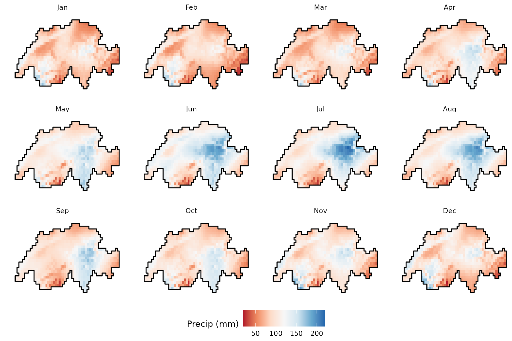
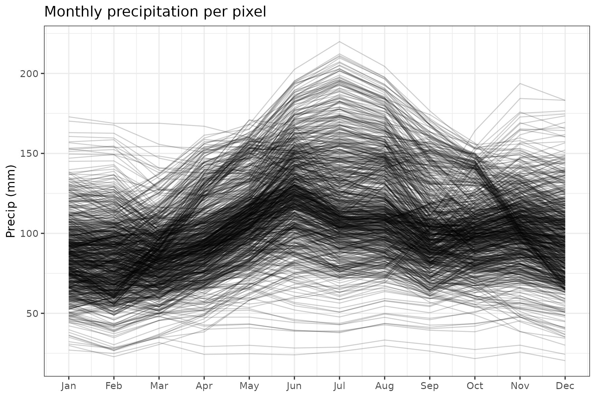
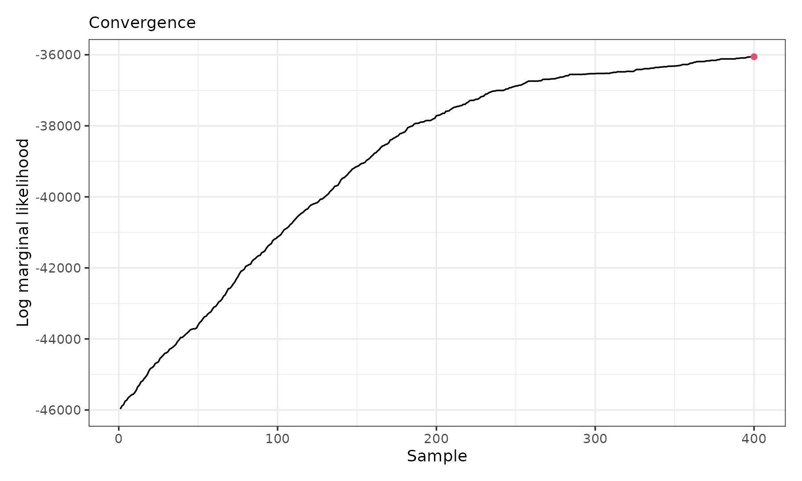
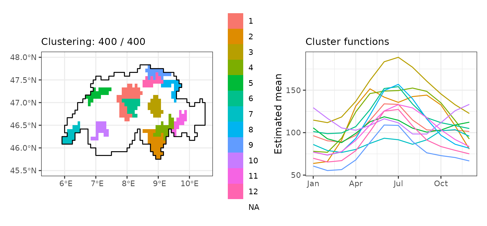
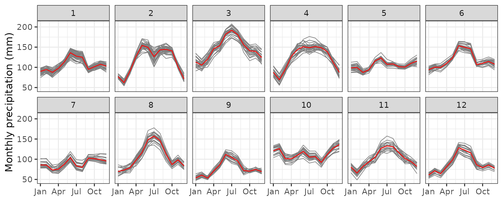

# Average seasonal precipitation in Switzerland

In this vignette, we use `sfclust` to cluster regions with similar
average seasonal patterns between 1970-2000 in Switzerland.

## Load packages and data

``` r

library(sfclust)
library(stars)
library(ggplot2)
library(pbs)
```

The data is a `stars` cube with monthly precipitation (`prec`) for 823
valid grid cells across Switzerland, obtained from WorldClim via the
`geodata` package, aggregated to a coarser ~5km resolution, and masked
to the Swiss national boundary; the `month` dimension is a plain integer
(1-12) rather than a calendar date, since the data are 30-year monthly
averages, not observations from a specific year. It is available on our
GitHub repository:
<https://github.com/ErickChacon/sfclust/blob/main/tools/data/cheprec.rds>.

``` r

link <- "https://github.com/ErickChacon/sfclust/blob/main/tools/data/"
cheprec <- readRDS(gzcon(url(paste0(link, "cheprec.rds?raw=true"))))
cheprec
```

    #> stars object with 3 dimensions and 1 attribute
    #> attribute(s):
    #>        Min. 1st Qu. Median     Mean 3rd Qu.   Max.   NAs
    #> prec  20.41  83.055 100.04 102.9409 119.065 219.92 11724
    #> dimension(s):
    #>       from to offset    delta refsys x/y
    #> x        1 60    5.5  0.08333 WGS 84 [x]
    #> y        1 30     48 -0.08333 WGS 84 [y]
    #> month    1 12      1        1     NA

## Exploratory analysis

We start by visualizing the raw monthly precipitation across the grid,
adding a boundary that limits our area of study.

``` r

pixel_boundary <- st_as_stars(cheprec["prec", , , 1]) |>
  st_as_sf(as_points = FALSE, na.rm = TRUE) |>
  st_union()

ggplot() +
  geom_stars(aes(fill = prec), data = cheprec) +
  geom_sf(data = pixel_boundary, fill = NA, color = "black", linewidth = 0.5) +
  facet_wrap(~ factor(month, labels = month.abb), ncol = 4) +
  scale_fill_distiller(palette = "RdBu", direction = 1, na.value = NA) +
  labs(fill = "Precip (mm)") +
  coord_sf() +
  theme_void(base_size = 9) +
  theme(legend.position = "bottom")
```

    #> Warning: Removed 11724 rows containing missing values or values outside the scale range
    #> (`geom_raster()`).



We can also plot the pixel-level time series, where different profiles
can be observed, many with peaks in July while others with a flat
pattern:

``` r

ggplot(data.frame(cheprec), aes(month, prec, group = interaction(x, y))) +
  geom_line(alpha = 0.2, linewidth = 0.4) +
  scale_x_continuous(breaks = 1:12, labels = month.abb) +
  labs(title = "Monthly precipitation per pixel", x = NULL, y = "Precip (mm)") +
  theme_bw()
```

    #> Warning: Removed 11724 rows containing missing values or values outside the scale range
    #> (`geom_line()`).



## Model fitting

As we are modelling the average seasonal precipitation, we need a
flexible and cyclic representation for the within-cluster model. In this
case, we represent the within cluster mean as a linear combination of
$`K = 5`$ periodic B-spline basis functions $`B_k(t)`$, built with the
**pbs** package, which enforces that the fitted curve and its derivative
have a cyclic pattern at January and December (cell $`i`$, month $`t`$):

``` math
\text{prec}_{it} = \sum_{k=1}^{K} \beta_k B_k(t) + \varepsilon_{it}
```

For a raster `stars` cube, [`sfclust()`](../reference/sfclust.md) builds
the spatial adjacency graph automatically and excludes `NA` cells.
However, the spatial dimensions (`spnames`) should be explicitly given.
We initialize with one cluster per grid cell (`nclust = 823`) and let
the algorithm merge similar cells:

``` r

set.seed(7)
formula <- prec ~ pbs(month, df = 5, Boundary.knots = c(0.5, 12.5))
result <- sfclust(
    cheprec, nclust = 823, spnames = c("x", "y"), formula = formula,
    niter = 4000, thin = 10, nmessage = 100, nsave = 1000,
    path_save = "cheprec-mcmc.rds"
)
result
```

    #> Within-cluster formula:
    #> prec ~ pbs(month, df = 5, Boundary.knots = c(0.5, 12.5))
    #> 
    #> Clustering hyperparameters:
    #>   log(1-q)      birth      death     change      hyper 
    #> -0.6931472  0.4250000  0.4250000  0.1000000  0.0500000 
    #> 
    #> Clustering movement counts:
    #>  births  deaths changes  hypers 
    #>      79     805      83     195 
    #> 
    #> Log marginal likelihood (sample 400 out of 400): -36054.85

Starting from 823 singleton clusters, the algorithm performed 805 merges
against only 79 splits, consolidating the initial cells into 96
clusters. The marginal likelihood reached a value of -36,054.8. After
thinning, 400 samples were retained.

## Results

According to the [`summary()`](https://rdrr.io/r/base/summary.html)
output, the ten largest clusters together cover about 30% of the 823
grid cells. The largest clusters contain 44, 36, and 24 pixels,
respectively.

``` r

summary(result, sort = TRUE)
```

    #> Summary for clustering sample 400 out of 400 
    #> 
    #> Within-cluster formula:
    #> prec ~ pbs(month, df = 5, Boundary.knots = c(0.5, 12.5))
    #> 
    #> Counts per cluster:
    #>  1  2  3  4  5  6  7  8  9 10 11 12 13 14 15 16 17 18 19 20 21 22 23 24 25 26 
    #> 44 36 24 24 22 22 21 20 19 19 18 17 17 17 17 17 16 15 15 15 14 13 13 13 13 12 
    #> 27 28 29 30 31 32 33 34 35 36 37 38 39 40 41 42 43 44 45 46 47 48 49 50 51 52 
    #> 12 12 12 11 10 10 10 10 10  9  9  8  8  8  7  7  7  6  6  6  6  6  6  6  6  6 
    #> 53 54 55 56 57 58 59 60 61 62 63 64 65 66 67 68 69 70 71 72 73 74 75 76 77 78 
    #>  6  5  5  5  5  4  4  4  4  4  4  4  4  4  4  3  3  3  3  3  2  2  2  2  2  2 
    #> 79 80 81 82 83 84 85 86 87 88 89 90 91 92 93 94 95 96 
    #>  2  2  2  2  2  1  1  1  1  1  1  1  1  1  1  1  1  1 
    #> 
    #> Log marginal likelihood:  -36054.85

The progress of the log marginal-likelihood shows improvement through
the iterations, with more stabilization around the end. In practice, you
will want to run the chain longer.

``` r

plot(result, which = 3)
```



The figure below shows the twelve largest clusters over the grid and
their fitted functional shapes:

``` r

gg1 <- plot_clusters_map(result, sort = TRUE, clusters = 1:12, legend = TRUE) +
  geom_sf(data = pixel_boundary, fill = NA, color = "black", linewidth = 0.5) +
  labs(x = NULL, y = NULL) +
  scale_fill_hue(na.value = NA)
gg2 <- plot_clusters_fitted(result, sort = TRUE, clusters = 1:12) +
  scale_x_continuous(breaks = seq(1, 12, 3), labels = month.abb[seq(1, 12, 3)])
gg1 + gg2
```

    #> Warning: Removed 1514 rows containing missing values or values outside the scale range
    #> (`geom_raster()`).



The fitted precipitation cycles here differ genuinely in shape: some
clusters show a single smooth peak in mid-summer at markedly different
amplitudes, some are comparatively flat with only a mild summer rise,
and others are distinctly bimodal, with a secondary rise toward the end
of the year.

## Empirical precipitation per cluster

Finally, we visualize the raw pixel-level precipitation within each of
the twelve largest clusters, confirming that grid cells assigned to the
same cluster share a consistent seasonal shape, including the less
common bimodal pattern of some clusters, while the amplitude and timing
of the peak vary substantially across clusters.

``` r

plot_clusters_series(result, prec, sort = TRUE, clusters = 1:12) +
  facet_wrap(~ cluster, ncol = 6) +
  scale_x_continuous(breaks = seq(1, 12, 3), labels = month.abb[seq(1, 12, 3)]) +
  labs(y = "Monthly precipitation (mm)")
```


