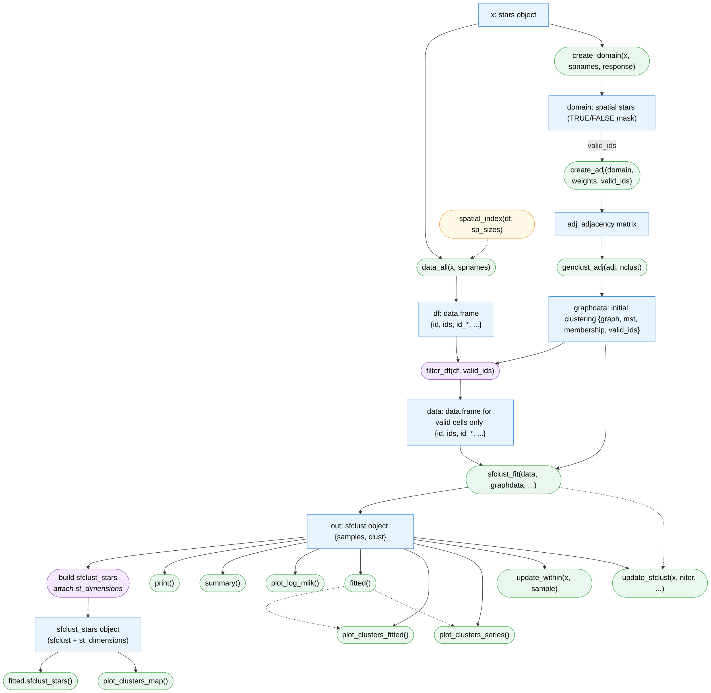
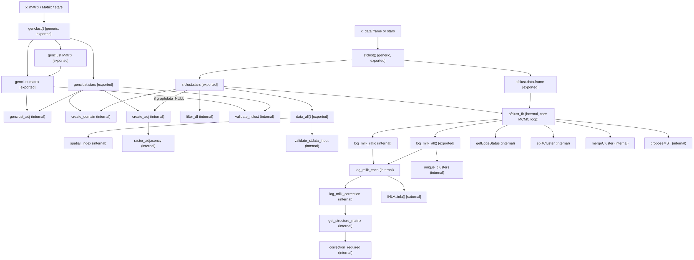

# sfclust — internal data-flow and call map

Design doc, not part of the package build. Explains the input/output
contracts between `genclust()`, `data_all()`, and `sfclust()`, and how every
exported and internal function in `R/generate-clusters.R`,
`R/data-preparation.R`, `R/model-inla.R`, `R/model-sfclust.R`, and
`R/spanning-tree.R` connects to the others.

## 1. Data-flow

The algorithm actually performs the Bayesian spatial functional clustering is
implemented in `sfclust_fit()`. It takes two required arguments: `data` and
`graphdata`. `data` is a long-format data frame with one row per
spatial-unit/time-point combination, carrying the identifier columns `id`, `ids`,
`id_*` alongside the response and covariates. `graphdata` is a list holding the
adjacency graph of the spatial units under study, a minimum spanning tree over that
graph, a `membership` vector giving an initial clustering (which `sfclust_fit()` then
updates via birth/death/change moves), and `valid_ids`, the indices of the spatial
units actually included in the analysis.

Both arguments are just transformations of the original input, computed
before `sfclust_fit()` is ever called — `sfclust_fit()` itself has no
knowledge of `stars` objects. `graphdata` comes from an adjacency matrix via
`genclust_adj(adj, nclust)`, which builds the graph/MST and cuts `nclust - 1`
random MST edges to get the initial membership. For `stars` input, that
adjacency matrix doesn't have to be supplied by hand: `create_domain(x,
spnames, response)` first marks which spatial cells are valid (all of them if
`response = NULL`), `genclust.stars()` derives `valid_ids <-
which(domain[[1]])` from that mask, and `create_adj(domain, weights,
valid_ids)` builds the adjacency directly from the `stars` geometry —
dispatching on `length(dimnames(domain))`: 1 spatial dimension uses vector
geometry (`st_touches`), 2 uses `raster_adjacency()` — subsetting the result
to `adj[valid_ids, valid_ids]`.

`data` is derived just as directly from the `stars` object, independently of
`graphdata`: `data_all(x, spnames)` flattens `x` into a long data frame with
every row (all cells, including invalid ones), using `spatial_index(df,
sp_sizes)` internally to assign each cell its flat, column-major `ids`
position. `filter_df(df, valid_ids)` then restricts that raw data frame down
to `data` — the same `valid_ids` computed for `graphdata` — without
remapping `ids`, so `data$ids`, the adjacency's row/col indices, and
`graphdata$membership` all keep referring to the same spatial units.

`sfclust_fit()` returns the fitted `sfclust` object (`out`). For `stars`
input, `out` additionally gets `st_dimensions(x)` attached (`build
sfclust_stars`), becoming a `sfclust_stars` object.

From `out`, `print()`, `summary()`, `plot_log_mlik()`, `fitted()`,
`plot_clusters_fitted()`, `plot_clusters_series()`, `update_within()`, and
`update_sfclust()` all operate directly on the `sfclust` object. The dashed
edges show internal reuse rather than a fresh input: `plot_clusters_fitted()`
and `plot_clusters_series()` both call `fitted()` internally to build their
data, and `update_sfclust()` re-invokes `sfclust_fit()` to draw more MCMC
samples, simply returning whatever `sfclust_fit()` produces. `update_within()`
instead refits a single stored sample's within-cluster models in place,
without calling `sfclust_fit()` again.

From `sfclust_stars`, `fitted.sfclust_stars()` and `plot_clusters_map()` are
additionally available — `plot_clusters_map()` needs the attached spatial
dimensions, so it only works on `sfclust_stars`, not on a plain `sfclust`
object.

### Main workflow

**1) Initialize spatial clusters.** `genclust()` is the main function used to
build the initial `graphdata` partition, wrapping `create_domain()`,
`create_adj()`, and `genclust_adj()` behind a single S3 generic. For `matrix`
and `Matrix` input the adjacency is already given, so `genclust()` calls
`genclust_adj()` directly. For `stars` input (`genclust.stars()`), it first
calls `create_domain(x, spnames, response)` to get the validity mask, derives
`valid_ids`, then `create_adj(domain, weights, valid_ids)` to build the
adjacency straight from the geometry, and finally `genclust_adj(adj, nclust)`
to cut the MST into the initial `membership`. `create_adj()` and
`genclust_adj()` remain independently useful — a user can call `create_adj()`
alone to get `ADJ` without generating a partition.

**2) Clustering with data frames.** `sfclust.data.frame(x, adjacency,
graphdata = NULL, fnames = NULL, nclust = 10, ...)` is the core-interface
wrapper for when `data` already exists as a plain data frame. If `graphdata`
isn't supplied, it's built on the spot from `adjacency` via `genclust_adj()`;
either way, `sfclust.data.frame()` then calls `sfclust_fit(x, graphdata,
...)` directly with the user's data frame as-is — no `stars`-specific
preprocessing happens on this path.

**3) Clustering with `stars` objects.** `sfclust.stars(x, nclust = 10,
graphdata = NULL, spnames = NULL, ...)` is the wrapper used for spatial
`stars` input. If `graphdata` isn't supplied, it's built by calling
`genclust(x, spnames, response, nclust)` from workflow (1); either way,
`sfclust.stars()` then derives `data <- filter_df(data_all(x, spnames),
graphdata$valid_ids)` and calls `sfclust_fit(data, graphdata, ...)`.
`sfclust.stars` and `sfclust.data.frame` are siblings, not caller/callee —
both call `sfclust_fit()` directly with almost the same argument list, and
`sfclust.stars` duplicates rather than delegates to `sfclust.data.frame`.
This duplication is a known, accepted tradeoff, not an oversight.

## 2. Full function call map

Every exported and internal function across `generate-clusters.R`,
`data-preparation.R`, `model-inla.R`, `model-sfclust.R`, and
`spanning-tree.R`, and how they call each other. Solid arrows = direct
function call. Dashed arrows = hidden coupling via attributes (not a function
argument) — there are none left in the current implementation, so all arrows
below are solid.

**Things this map makes visible:**

- **`sfclust.stars` and `sfclust.data.frame` are siblings, not caller/callee.**
  Both call `sfclust_fit()` directly with almost the same argument list
  (`move_prob`, `logpen`, `correction`, `niter`, `burnin`, `thin`, `nmessage`,
  `path_save`, `nsave`, `...`). `sfclust.stars` does the extra work of turning
  `x` into `data`/`adjacency`/`graphdata` first, then duplicates the
  `sfclust_fit()` call instead of delegating to `sfclust.data.frame()`.
- **`genclust_adj()` has two independent call sites**: from `genclust.stars`
  and from `genclust.matrix` — both go through explicit adjacency builders
  (`create_adj` or direct matrix input) with no hidden attributes.
- **No hidden edges**: every edge in the graph is a normal function argument;
  there is no `valid_ids` attribute coupling anywhere.
- **`validate_nclust()`** is called from both `genclust.matrix()` and
  `genclust.stars()` directly.
